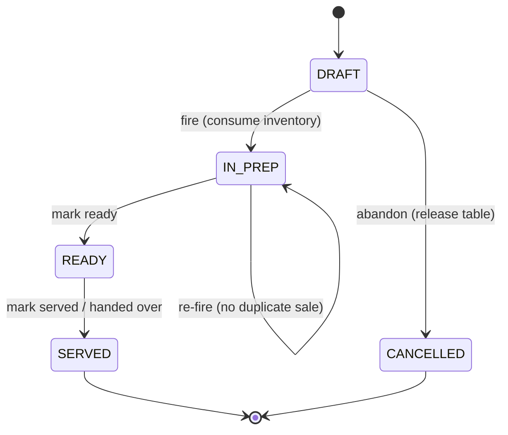
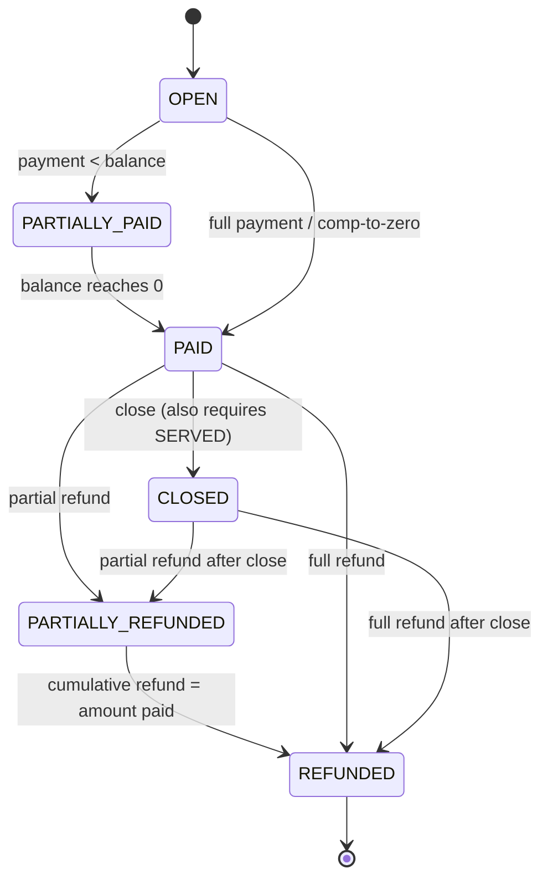
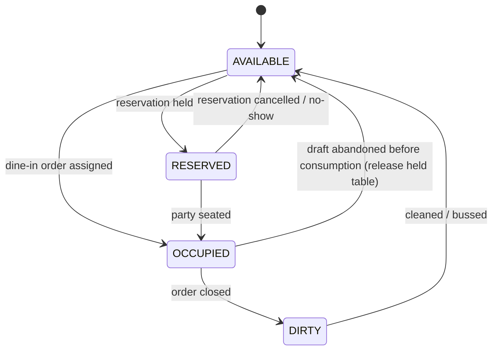
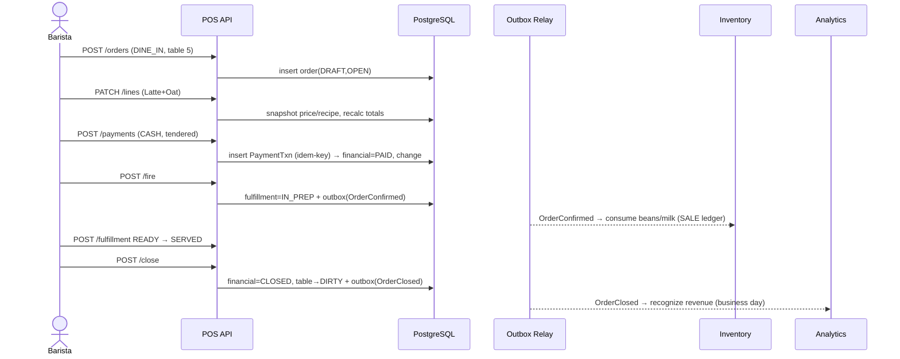
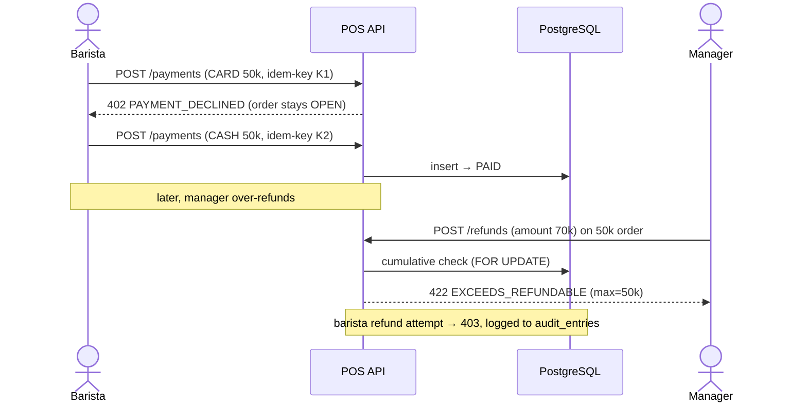
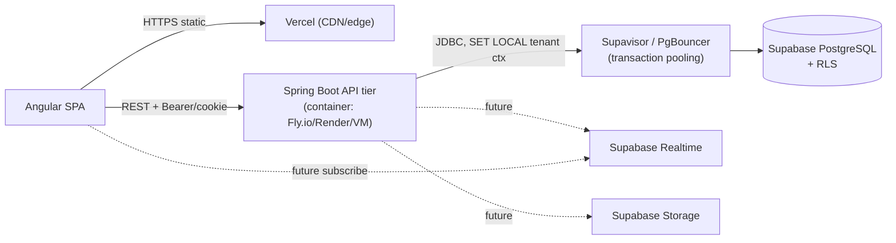

# Architecture Decision Document — POS Order Management (Epic 1)

> **Module:** `pos` (within the Modular Monolith)
> **Stack:** Java 21 · Spring Boot 3 · Spring Data JPA · **Supabase PostgreSQL (managed)** · **Supabase CLI migrations** · **Angular SPA on Vercel**
> **Platform note (2026-06-14):** Supabase is treated as *managed PostgreSQL + platform services*. All business logic stays in the portable Spring Boot API tier; no domain/application code depends on Supabase-specific APIs (supabase-js / PostgREST / Edge Functions). The schema is plain Postgres so it can migrate to self-hosted PostgreSQL. **See [Part III — Platform & Stack Update](#part-iii--platform--stack-update-supabase--vercel--angular-2026-06-14)** for the full treatment of deployment, RLS, auth decoupling, and migration strategy.
> **Author:** TRUNG · **Date:** 2026-06-14
> **Source of truth:** `epics.md` *locked architectural decisions* take precedence over `brainstorm.md` v1.0 where they conflict (notably: deduction-at-confirmation vs deduction-at-prep, and two-axis vs single-axis order state).

---

## 0. Senior-Architect Framing & Challenged Assumptions

Before the design, four assumptions in the inputs that I am deliberately **rejecting or reshaping**, with the tradeoff:

| # | Assumption in source | Decision | Why / Tradeoff |
|---|---|---|---|
| A1 | `brainstorm.md §13`: deduct inventory at `CONFIRMED→PREPARING` | **Reject.** Consume at **confirmation (fire)** as a single atomic event; reconcile drift by periodic physical count. | A prep-tap is a manual UI action a barista may forget under rush; tying money-grade inventory to it makes COGS unreliable. Tradeoff: theoretical stock can go negative between fire and physical count — accepted, and *flagged not blocked* per locked decision. |
| A2 | `brainstorm.md §8`: single linear order status `DRAFT→CONFIRMED→PREPARING→READY→COMPLETED→REFUNDED` | **Reject.** Two **orthogonal** state axes — *fulfillment* and *financial*. | A single axis cannot express "served but unpaid" (table service) nor "paid but not yet made" (pay-first). Refund-as-status (`COMPLETED→REFUNDED`) destroys partial-refund and audit. Tradeoff: more states to test, but the only honest model. |
| A3 | `brainstorm.md §9`: `Order.Payment` (one payment per order) | **Reject.** Payment is a **collection of immutable payment transactions** (charges + reversing refunds). | Split tender and partial refunds are first-class requirements (US-09, UC-06). Tradeoff: balance is a derived sum, never a stored mutable field — slightly more compute, far more correctness. |
| A4 | RBAC is the 3 fixed roles | **Reshape.** 3 base roles **+ per-action grants** (void/refund/comp/discount). | Locked decision. A manager at one shop may not refund; a senior barista may. Tradeoff: a permission table and checks beyond `@PreAuthorize("hasRole(...)")`. |

**Money:** every monetary value is a `BIGINT` of **minor units** (VND has no minor unit in practice, but we store the smallest tradeable unit the shop uses; the type is integer to forbid float drift). No `double`/`float` touches money — ever.

**Snapshotting:** product name, selling price, modifier surcharge, and the recipe (BOM) are **copied onto the order line at sale time**. Catalog edits and recipe changes never retro-alter a historical order, its revenue, or its COGS.

---

## 1. Responsibilities

### Problems this feature solves
- Run a full trading day for **one branch** end-to-end without paper: take orders → take money correctly → make drinks → reconcile the drawer.
- Produce **trustworthy revenue** (split/idempotent payments, reversing refunds) and **honest inventory consumption** that downstream COGS/Profit analytics can trust.
- Enforce **accountability**: every void/refund/comp/discount is permissioned and audited (who + why).

### Boundaries (what this module owns)
- The **Order aggregate** and its two lifecycles (fulfillment + financial).
- **Payment transactions** (charges + refunds) and **balance** derivation.
- **Drawer/Shift sessions** and cash reconciliation.
- **Table occupancy transitions** *driven by orders* (assign on Dine-In, free on close).
- Emitting **inventory-intent events** (consume / restore) and **revenue-recognition events**.
- The POS-specific **audit entries** for sensitive actions.

### Explicitly NOT this feature's job
| Out of scope | Belongs to |
|---|---|
| Defining products, categories, modifiers, prices, recipes | **Catalog** module (POS only *reads & snapshots*) |
| Computing/holding stock levels, ledger math, transfers, physical-count workflow | **Inventory** module (POS only *requests* consume/restore via event) |
| Revenue/COGS/Profit reports & dashboards | **Analytics** module (POS only *emits* the facts) |
| User identity, PIN, JWT issuance, branch membership | **Auth** module (POS only *consumes* the principal) |
| KDS hardware, receipt printing, offline sync, promotions engine, gateway webhooks | **Epic 2** (production hardening) |
| Table CRUD / floor layout | **Catalog/Branch** admin (POS only flips occupancy status) |

> **Boundary tradeoff:** POS does *not* write the inventory ledger directly. It publishes intent and Inventory owns the ledger. This keeps the ledger as the single writer of truth (auditable, replayable) at the cost of eventual consistency on the *theoretical* stock number — which the locked "flag don't block" rule already tolerates.

---

## 2. Domain Model

### Aggregates & ownership

```
Order  (Aggregate Root)  ──────────────── owns ───────────────┐
  ├─ OrderLine (1..*)            [snapshot of product @ sale]   │
  │     └─ OrderLineModifier (0..*)  [snapshot of modifier]     │
  ├─ OrderAdjustment (0..*)      [comp / discount, line or order scope]
  └─ PaymentTransaction (0..*)   [CHARGE or REFUND, immutable, append-only]

DrawerSession (Aggregate Root)   [independent lifecycle; payments reference it]

Table  (owned by Catalog/Branch; POS holds only a reference + flips status)
```

**Aggregate rule:** the **Order is the consistency boundary**. Lines, modifiers, adjustments, and payment transactions are loaded and persisted with their order inside one transaction. `DrawerSession` is a *separate* aggregate referenced by id (avoid a giant order↔session graph).

### Entities & key attributes

**Order**
| Attribute | Type | Notes |
|---|---|---|
| id | UUID | |
| branchId | UUID | from JWT; immutable after create |
| businessDay | DATE | computed from completion time + branch business-day boundary |
| orderType | enum `DINE_IN`/`TAKEAWAY` | |
| tableId | UUID? | required iff DINE_IN |
| customerName | text? | for TAKEAWAY |
| fulfillmentState | enum | see §3 |
| financialState | enum | see §3 |
| subtotalMinor | BIGINT | derived, persisted for query speed (denormalized cache) |
| discountMinor | BIGINT | sum of adjustments |
| totalMinor | BIGINT | subtotal − discount |
| version | int | optimistic lock (`@Version`) |
| createdBy / createdAt / firedAt / closedAt | audit | |

**OrderLine** (snapshot)
`id, orderId, productId, productNameSnapshot, unitPriceMinorSnapshot, quantity, recipeSnapshot(jsonb), lineState(ACTIVE/VOIDED/COMPED), lineSubtotalMinor`

**OrderLineModifier** (snapshot)
`id, orderLineId, modifierId, modifierNameSnapshot, surchargeMinorSnapshot`

**OrderAdjustment** (comp/discount)
`id, orderId, orderLineId?(null = whole order), type(COMP/DISCOUNT_PCT/DISCOUNT_AMT), value, resultingDiscountMinor, reason, authorizedBy, createdAt`

**PaymentTransaction** (immutable, append-only — the money ledger of the order)
`id, orderId, drawerSessionId?(cash only), kind(CHARGE/REFUND), method(CASH/CARD/QR), amountMinor(+ for charge, signed −logical for refund), tenderedMinor?(cash), changeMinor?(cash), idempotencyKey(unique), reason?(refunds), actor, createdAt`

**DrawerSession**
`id, registerId, branchId, openedBy, openingFloatMinor, openedAt, closedAt?, countedCashMinor?, expectedCashMinor?(derived), varianceMinor?, state(OPEN/CLOSED), note?`

### Relationships
```
Branch 1───* Order        Order 1───* OrderLine        OrderLine 1───* OrderLineModifier
Order 1───* PaymentTransaction        Order 1───* OrderAdjustment
DrawerSession 1───* PaymentTransaction(cash)
Table 0..1───* Order (active dine-in)
User 1───* DrawerSession / Order (createdBy)
```

### Lifecycle (high level)
1. **Create** → Order(DRAFT, OPEN). Lines editable.
2. **Fire (confirm)** → fulfillment `DRAFT→IN_PREP`; **inventory consume event published**; lines frozen for prep (further changes go through void/comp, not silent edit).
3. **Pay** (any time after create, before or after fire) → PaymentTransactions accrue; financial reaches PAID when balance = 0.
4. **Ready → Served** (fulfillment).
5. **Close** (needs PAID|comped-to-zero **and** SERVED) → financial `→CLOSED`; **revenue recognized**; table freed.
6. **Refund** (post-payment) → append reversing PaymentTransaction(s); financial → PARTIALLY_REFUNDED / REFUNDED; **inventory restore event** for refunded lines.
7. **Abandon** (DRAFT only) → CANCELLED; release table; no revenue, no consumption.

> **Derived-vs-stored tradeoff:** balance/total are *derivable* (sum of lines − discounts − payments). I persist `totalMinor`/`subtotalMinor` as a cache for list queries, but **financial-state transitions recompute from the transactions table**, never trust the cached field. The cache is an index, not a source of truth.

### Aggregate roots / Entities / Value Objects (explicit)

| Classification | Members | Rationale |
|---|---|---|
| **Aggregate roots** | `Order`, `DrawerSession` | Each is a consistency boundary loaded/saved as a unit with its own `@Version`. Cross-aggregate references are **by id only** (e.g. `PaymentTransaction.drawerSessionId`), never object graph. |
| **Entities** (inside Order) | `OrderLine`, `OrderLineModifier`, `OrderAdjustment`, `PaymentTransaction` | Have identity + lifecycle, but exist only within an Order; no independent repository. |
| **Value Objects** (immutable, no identity) | `Money(amountMinor, currency)`, `PriceSnapshot`, `RecipeSnapshot(items[{ingredientId, qtyMinor, unit}])`, `IdempotencyKey`, `BusinessDay(date)`, `Variance(expectedMinor, countedMinor, deltaMinor)`, and the enums `OrderType` / `FulfillmentState` / `FinancialState` / `PaymentMethod` / `PaymentKind` | Compared by value, never mutated in place. `Money` is the only money carrier — arithmetic lives here, forbidding raw `long` math leaking around the codebase. Snapshots are frozen copies taken from Catalog at sale time. |

> **VO tradeoff:** modeling `Money` as a VO (not a bare `long`) costs a wrapper allocation per line but eliminates an entire class of currency-mismatch and unit bugs, and gives one place to enforce "no float, no negative." `RecipeSnapshot` stored as `jsonb` is a VO frozen on the line — deliberately denormalized so a recipe edit in Catalog can never retro-change a historical order's COGS.

---

## 3. State Machines

### 3.1 Fulfillment state



**Valid:** DRAFT→IN_PREP, DRAFT→CANCELLED, IN_PREP→READY, READY→SERVED, IN_PREP→IN_PREP(re-fire).
**Invalid (rejected):** any backward move (READY→DRAFT), SERVED→anything, CANCELLED→anything, skipping (DRAFT→READY), CANCELLED of a fired order (use void/refund + restore instead).

### 3.2 Financial state



**Valid:** OPEN→PARTIALLY_PAID→PAID, OPEN→PAID, PAID→CLOSED, {PAID,CLOSED}→PARTIALLY_REFUNDED→REFUNDED, {PAID,CLOSED}→REFUNDED.
**Invalid (rejected):**
- Any refund while OPEN/PARTIALLY_PAID (nothing captured yet → it's a **void**, not a refund).
- Cumulative refunds **exceeding** amount paid (UC-06 E1).
- CLOSE while balance > 0 and not comped-to-zero (UC-04 E1).
- A second CHARGE after PAID (balance already 0).

> **Tradeoff — two axes vs one:** orthogonality is the cost (16 nominal combinations) but most are unreachable; we guard transitions, not the cartesian product. The benefit is that *pay-first* (PAID + DRAFT) and *make-first table service* (SERVED + OPEN) both fall out naturally with **zero special-casing**.

### 3.3 Table occupancy state

> Table identity/layout is **owned by Catalog/Branch**; POS only *drives status transitions* in response to order events. `brainstorm.md §7` defines AVAILABLE/OCCUPIED/RESERVED; UC-04 adds the post-service cleaning step, so I introduce **DIRTY**.



**Valid:** AVAILABLE→OCCUPIED, AVAILABLE→RESERVED, RESERVED→OCCUPIED, RESERVED→AVAILABLE, OCCUPIED→DIRTY, OCCUPIED→AVAILABLE (abandon path), DIRTY→AVAILABLE.
**Invalid (rejected):**
- Assigning a **second active dine-in order** to an OCCUPIED table (one active order per table — guarded by the partial index in §4 `(table_id) WHERE active`).
- OCCUPIED→RESERVED (can't reserve a seated table).
- DIRTY→OCCUPIED (must be cleaned to AVAILABLE first — preserves the bussing step).
- AVAILABLE→DIRTY (nothing was served).

> **Tradeoff — who owns the transition:** POS flips status but Catalog owns the row. To avoid a distributed write, POS updates table status **within the same transaction** as the order action that triggers it (assign-on-fire, free-on-close) since both live in the same monolith/DB. If tables ever move to a separate service, this becomes an event (`TableOccupied`/`TableFreed`) — the seam is already named. RESERVED is modeled but reservations themselves are an Epic-2/3 concern; for MVP only AVAILABLE↔OCCUPIED↔DIRTY are exercised.

### 3.4 Drawer session
`[*]→OPEN→CLOSED`. Invariant: **at most one OPEN session per register** (DB partial unique index). Cash payments/refunds may only attach to an OPEN session.

---

## 4. Database Design

> **Canonical, implementation-ready schema lives in [`database-design.md`](./database-design.md)** (full ERD, complete DDL across `auth`/`catalog`/`inventory`/`pos`, enum value sets, snapshot strategy, append-only triggers, audit tables). This section is the summary.

> **Supabase CLI** migration (plain Postgres SQL, portable to self-host — see Part III §8), schema `pos`. All money `BIGINT` minor units. All ids `UUID` (`gen_random_uuid()`, pgcrypto available on Supabase). All timestamps `TIMESTAMPTZ`. **RLS** is enabled on all tenant tables (Part III §4/§5).

### `pos.orders`
| Column | Type | Constraint |
|---|---|---|
| id | uuid PK | |
| branch_id | uuid NOT NULL | (logical FK → branch; cross-module, no hard FK) |
| business_day | date NOT NULL | |
| order_type | text NOT NULL | CHECK in (`DINE_IN`,`TAKEAWAY`) |
| table_id | uuid NULL | CHECK (`order_type='DINE_IN'` ⇒ table_id NOT NULL) |
| customer_name | text NULL | |
| fulfillment_state | text NOT NULL | CHECK in enum |
| financial_state | text NOT NULL | CHECK in enum |
| subtotal_minor | bigint NOT NULL DEFAULT 0 | CHECK ≥ 0 |
| discount_minor | bigint NOT NULL DEFAULT 0 | CHECK ≥ 0 |
| total_minor | bigint NOT NULL DEFAULT 0 | CHECK ≥ 0 |
| version | int NOT NULL DEFAULT 0 | optimistic lock |
| created_by | uuid NOT NULL | |
| created_at / fired_at / closed_at | timestamptz | created_at NOT NULL |

**Indexes:** `(branch_id, business_day)`, `(branch_id, fulfillment_state) WHERE fulfillment_state IN ('IN_PREP','READY')` (ticket board), `(table_id) WHERE fulfillment_state <> 'SERVED' AND fulfillment_state <> 'CANCELLED'`.

### `pos.order_lines`
`id pk, order_id fk→orders ON DELETE CASCADE, product_id uuid, product_name_snapshot text, unit_price_minor bigint CHECK≥0, quantity int CHECK>0, recipe_snapshot jsonb NOT NULL, line_state text CHECK in('ACTIVE','VOIDED','COMPED'), line_subtotal_minor bigint`.
**Index:** `(order_id)`.

### `pos.order_line_modifiers`
`id pk, order_line_id fk ON DELETE CASCADE, modifier_id uuid, modifier_name_snapshot text, surcharge_minor bigint CHECK≥0`.

### `pos.order_adjustments`
`id pk, order_id fk, order_line_id fk NULL, type text CHECK in('COMP','DISCOUNT_PCT','DISCOUNT_AMT'), value numeric, resulting_discount_minor bigint CHECK≥0, reason text NOT NULL, authorized_by uuid NOT NULL, created_at timestamptz NOT NULL`.

### `pos.payment_transactions` *(append-only — no UPDATE/DELETE)*
| Column | Type | Constraint |
|---|---|---|
| id | uuid PK | |
| order_id | uuid NOT NULL FK→orders | |
| drawer_session_id | uuid NULL FK→drawer_sessions | CHECK (`method='CASH'` ⇒ drawer_session_id NOT NULL) |
| kind | text NOT NULL | CHECK in (`CHARGE`,`REFUND`) |
| method | text NOT NULL | CHECK in (`CASH`,`CARD`,`QR`) |
| amount_minor | bigint NOT NULL | CHECK > 0 (sign implied by `kind`) |
| tendered_minor / change_minor | bigint NULL | cash only |
| idempotency_key | text NOT NULL | **UNIQUE** |
| reason | text NULL | required when kind=REFUND |
| actor | uuid NOT NULL | |
| created_at | timestamptz NOT NULL | |

**Indexes:** `(order_id)`, `UNIQUE(idempotency_key)`, `(drawer_session_id) WHERE method='CASH'`.

### `pos.drawer_sessions`
`id pk, register_id uuid NOT NULL, branch_id uuid NOT NULL, opened_by uuid, opening_float_minor bigint CHECK≥0, opened_at timestamptz, closed_at timestamptz NULL, counted_cash_minor bigint NULL, expected_cash_minor bigint NULL, variance_minor bigint NULL, state text CHECK in('OPEN','CLOSED'), note text NULL`.
**Index (the key invariant):** `CREATE UNIQUE INDEX uq_one_open_drawer ON pos.drawer_sessions(register_id) WHERE state='OPEN';`

### `pos.audit_entries`
`id pk, order_id uuid NULL, actor uuid, action text, reason text NULL, payload jsonb, created_at timestamptz`. Index `(order_id)`, `(actor, created_at)`.

### Important business rules enforced at DB level
- **One open drawer per register** → partial unique index (race-proof, not app-checked).
- **Idempotent payments** → unique `idempotency_key` (duplicate charge attempt fails at insert, caught and treated as success — UC-02 E2).
- **Dine-in needs a table** → CHECK constraint.
- **Money never negative** → CHECK ≥ 0 on amounts; refund "sign" lives in `kind`, not in a negative number (keeps sums readable).
- **Payment transactions immutable** → enforced by convention + a `REVOKE UPDATE,DELETE` grant on the table for the app role (defense in depth).

> **Cross-module FK tradeoff:** `branch_id`, `product_id`, `table_id` are logical references with **no hard FK** across module schema boundaries — this preserves modular-monolith independence and lets modules migrate separately, at the cost of referential integrity being an application invariant. Within `pos`, FKs are hard.

---

## 5. APIs

Base: `/api/pos`. All require JWT (branch + role + grants in claims). All write endpoints accept `Idempotency-Key` header where noted.

| # | Method | URL | Purpose |
|---|---|---|---|
| 1 | POST | `/orders` | Create draft order |
| 2 | PATCH | `/orders/{id}/lines` | Add/change/remove lines (DRAFT only) |
| 3 | POST | `/orders/{id}/fire` | Confirm/fire → consume inventory |
| 4 | POST | `/orders/{id}/payments` | Take a payment (idempotent) |
| 5 | POST | `/orders/{id}/fulfillment` | Advance READY / SERVED / re-fire / waste |
| 6 | POST | `/orders/{id}/close` | Close paid+served order |
| 7 | POST | `/orders/{id}/void` | Void unpaid item/order |
| 8 | POST | `/orders/{id}/refunds` | Refund (full/partial), reversing txn |
| 9 | POST | `/orders/{id}/adjustments` | Comp / discount |
| 10 | GET | `/orders/{id}` | Read order detail |
| 11 | GET | `/orders?branch&day&state` | List / ticket board |
| 12 | POST | `/drawer-sessions` | Open drawer |
| 13 | POST | `/drawer-sessions/{id}/close` | Close + reconcile |

Representative specs (others follow the same shape):

**3 — Fire order** `POST /api/pos/orders/{id}/fire`
- Request: `{}` (state derived from order). Header `Idempotency-Key`.
- Response `200`: `{ orderId, fulfillmentState:"IN_PREP", firedAt, consumptionRequested:true }`
- Validation: order exists, belongs to caller's branch, fulfillment=DRAFT, ≥1 ACTIVE line.
- Errors: `404` not found · `409 INVALID_STATE` (already fired/cancelled) · `422 EMPTY_ORDER` · `403` wrong branch.

**4 — Take payment** `POST /api/pos/orders/{id}/payments`
- Request: `{ method:"CASH"|"CARD"|"QR", amountMinor, tenderedMinor? }`, Header `Idempotency-Key` (**required**).
- Response `201`: `{ paymentId, financialState, balanceMinor, changeMinor? }`
- Validation: amount>0; amount ≤ remaining balance (overpay allowed only for CASH → change); cash requires an OPEN drawer session for caller's register; idempotency-key unique.
- Errors: `409 ALREADY_PAID` (balance 0) · `422 AMOUNT_EXCEEDS_BALANCE` (non-cash) · `409 NO_OPEN_DRAWER` · `200` replay (same key → returns original result, no double charge) · `402 PAYMENT_DECLINED` (digital; leaves order OPEN — UC-02 E1).

**8 — Refund** `POST /api/pos/orders/{id}/refunds`
- Request: `{ lineIds?:[], amountMinor?, method, reason }` (line-based or amount-based). Header `Idempotency-Key`.
- Response `201`: `{ refundId, financialState:"PARTIALLY_REFUNDED"|"REFUNDED", refundedTotalMinor, restorationRequested:true }`
- Validation: order has captured payment; **cumulative refund ≤ amount paid**; reason required; caller holds `REFUND` grant.
- Errors: `403 NO_REFUND_GRANT` (logged as attempt — UC-06/US-15) · `409 NOTHING_TO_REFUND` (OPEN order → "use void") · `422 EXCEEDS_REFUNDABLE` (returns max refundable).

**13 — Close drawer** `POST /api/pos/drawer-sessions/{id}/close`
- Request: `{ countedCashMinor }`
- Response `200`: `{ expectedCashMinor, countedCashMinor, varianceMinor, state:"CLOSED" }`
- Validation: session OPEN, owned by caller (or manager). Errors: `409 ALREADY_CLOSED`.

> **API tradeoff — verbs as sub-resources, not a generic `PATCH /status`:** `brainstorm.md §20` proposed `PATCH /orders/{id}/status`. I rejected it: a generic status patch hides which transition occurred, can't carry transition-specific payload (reason, tendered, idempotency), and makes per-action permissions awkward. Discrete intent endpoints (`/fire`, `/void`, `/refunds`) are self-documenting in OpenAPI and map 1:1 to audit actions and permission grants. Cost: more endpoints.

---

## 6. Domain Events

In-process Spring `ApplicationEventPublisher` (modular monolith), published **after commit** via `@TransactionalEventListener(phase = AFTER_COMMIT)` so subscribers never see uncommitted order state.

### Published by POS
| Event | When | Payload (key fields) | Subscribers |
|---|---|---|---|
| `OrderConfirmed` | fire succeeds | orderId, branchId, lines[{productId, recipeSnapshot, qty}] | **Inventory** (consume), Audit |
| `OrderClosed` | close succeeds | orderId, branchId, businessDay, totalMinor, lines[], paymentBreakdown | **Analytics** (revenue), Audit |
| `OrderRefunded` | refund recorded | orderId, refundedLines[], refundMinor, partial?:bool | **Inventory** (restore lines), **Analytics** (negative revenue), Audit |
| `OrderVoided` | void of fired order | orderId, voidedLines[] | **Inventory** (restore if consumed) |
| `OrderItemWasted` | remake waste | branchId, recipeSnapshot, qty | **Inventory** (WASTE ledger entry) |
| `DrawerClosed` | drawer close | sessionId, expected, counted, variance | Analytics/Audit |

### Consumed by POS
| Event | From | POS reaction |
|---|---|---|
| `InventoryConsumptionFlagged` | Inventory | mark order's stock as negative-flagged for review (display only — **never blocks**) |
| `ProductDeactivated` | Catalog | prevent adding to *new* draft lines (already-snapshotted lines unaffected) |

> **Event tradeoff — in-process now, broker later:** AFTER_COMMIT in-process events keep the consume/restore flow simple and transactional-adjacent without Kafka. The risk: if the app crashes *between* order commit and the inventory consume handler, the consume is lost (order committed, stock not decremented). I mitigate with an **outbox table** for the inventory-affecting events (`OrderConfirmed`, `OrderRefunded`, `OrderVoided`) so a relay can retry — see §7. Pure-audit/analytics events can stay fire-and-forget.

---

## 7. Transaction Boundaries

### Must be atomic (single DB transaction)
1. **Create/edit draft** — order + lines + modifiers + recalculated totals.
2. **Fire** — fulfillment transition **+ insert `OrderConfirmed` row into outbox** (NOT the inventory write itself). One commit; inventory consumption happens reactively.
3. **Take payment** — insert PaymentTransaction (idempotency-key unique) + recompute & persist financial state. The unique constraint *is* the concurrency guard.
4. **Refund** — insert reversing PaymentTransaction + financial transition + outbox `OrderRefunded`. Cumulative-refund check runs **inside** the txn against `SELECT ... FOR UPDATE` of the order row (or rely on `@Version`).
5. **Close** — financial→CLOSED + table→DIRTY + outbox `OrderClosed`.
6. **Drawer close** — compute expected from session's cash transactions + persist variance + state→CLOSED.

### Can be asynchronous (after commit, separately)
- **Inventory consumption / restoration** — driven by outbox relay reacting to `OrderConfirmed`/`OrderRefunded`/`OrderVoided`. Eventual consistency, retried until acked. This is *why* sales aren't blocked by stock.
- **Analytics aggregation** — `OrderClosed`/`OrderRefunded` consumed async to update read models.
- **Audit writes** for non-critical actions (critical ones — refund/void/comp — are written **in the same transaction** as the action, because the locked decision requires the attempt itself be recorded even when blocked).

> **Concurrency tradeoff:** I rely on **optimistic locking (`@Version`)** for order edits/transitions (rare contention — one barista per order) and **DB unique constraints** for the two real race points (duplicate payment, second open drawer). I deliberately avoid pessimistic table locks on the hot path to protect the `<500ms create-order` NFR. Refund is the one place I'd accept `SELECT FOR UPDATE` because cumulative-amount correctness outweighs its low frequency.

---

## 8. Sequence Diagrams

### Happy path — Dine-in, pay-first, fire, serve, close


### Alternative path — split payment + make-before-pay (table service)
Order fired and served while still OPEN; customer then pays 60k CARD + 40k CASH; balance hits 0 → PAID; then close. Demonstrates the orthogonal axes: `SERVED + OPEN` is a valid, expected combination.

### Failure path — declined card, then retry; and over-refund blocked


### 8.4 Take Payment (idempotent, split, with change)
```mermaid
sequenceDiagram
    actor B as Barista
    participant API as POS API
    participant DB as PostgreSQL
    B->>API: POST /orders/{id}/payments {CASH, amount, tendered}\nIdempotency-Key: K1
    API->>DB: BEGIN
    API->>DB: INSERT payment_transaction (idem_key=K1)
    alt idem_key already exists (retry/replay)
        DB-->>API: unique violation
        API->>DB: SELECT original txn by K1
        API-->>B: 200 (original result, NO double charge)
    else first time
        API->>DB: recompute balance = Σcharges − Σrefunds − total
        API->>DB: financial = PARTIALLY_PAID | PAID (balance 0)
        API->>DB: COMMIT
        API-->>B: 201 {paymentId, financialState, balanceMinor, changeMinor}
    end
    Note over API,DB: cash → must reference an OPEN drawer session; else 409 NO_OPEN_DRAWER
```

### 8.5 Refund (partial, reversing transaction + stock restore)
```mermaid
sequenceDiagram
    actor M as Manager
    participant API as POS API
    participant DB as PostgreSQL
    participant OBX as Outbox Relay
    participant INV as Inventory
    participant AN as Analytics
    M->>API: POST /orders/{id}/refunds {lineIds, method, reason}\nIdempotency-Key: R1
    API->>API: assert caller has REFUND grant (else 403 + audit attempt)
    API->>DB: BEGIN; SELECT order FOR UPDATE
    API->>DB: cumulative refunds + this ≤ amount paid?
    alt exceeds refundable
        API->>DB: ROLLBACK
        API-->>M: 422 EXCEEDS_REFUNDABLE {maxRefundableMinor}
    else ok
        API->>DB: INSERT payment_transaction(kind=REFUND, idem=R1)
        API->>DB: financial = PARTIALLY_REFUNDED | REFUNDED
        API->>DB: INSERT audit_entry(actor, reason)
        API->>DB: INSERT outbox(OrderRefunded, refundedLines)
        API->>DB: COMMIT
        OBX-->>INV: OrderRefunded → restore ingredients (ledger ADJUSTMENT/restore)
        OBX-->>AN: OrderRefunded → negative revenue in business day
        API-->>M: 201 {refundId, financialState, refundedTotalMinor}
    end
```

### 8.6 Close Shift (drawer reconciliation)
```mermaid
sequenceDiagram
    actor B as Barista
    participant API as POS API
    participant DB as PostgreSQL
    participant AN as Analytics
    B->>API: POST /drawer-sessions/{id}/close {countedCashMinor}
    API->>DB: BEGIN; SELECT session FOR UPDATE (assert state=OPEN, owned/manager)
    API->>DB: expected = openingFloat + Σ(CASH charges) − Σ(CASH refunds) on session
    API->>DB: variance = counted − expected
    API->>DB: state=CLOSED, persist expected/counted/variance
    API->>DB: INSERT outbox(DrawerClosed)
    API->>DB: COMMIT
    API-->>B: 200 {expectedCashMinor, countedCashMinor, varianceMinor}
    OBX-->>AN: DrawerClosed → shift reconciliation report
    Note over API,DB: second close → 409 ALREADY_CLOSED; opening 2nd OPEN on register → unique-index reject
```

> The earlier **Create & Fire** flow is §8.1 (happy path). Together §8.1/8.4/8.5/8.6 cover the four requested sequences; §8.2/8.3 add the make-before-pay and failure variants.

---

## 9. Security

### Authentication
JWT from Auth module carries `userId`, `branchId`, `role`, and `grants[]`. **Branch scoping is mandatory on every query** — the `branchId` filter is applied server-side from the token, never from a request param (prevents cross-branch data access). Admin is the only role allowed to pass an explicit `branchId` (US-21 cross-branch oversight).

### Required permissions & RBAC matrix
Base roles + per-action grants layered on top:

| Action | Barista | Manager | Admin | Grant gate |
|---|:--:|:--:|:--:|---|
| Create / edit draft order | ✅ | ✅ | ✅ | — |
| Fire / fulfillment / close | ✅ | ✅ | ✅ | — |
| Take payment | ✅ | ✅ | ✅ | — |
| Void **unpaid** item | ✅ | ✅ | ✅ | — |
| Void **fired** order | ⛔ | ✅ | ✅ | `VOID_FIRED` |
| Comp / discount | ⛔* | ✅ | ✅ | `COMP_DISCOUNT` |
| **Refund** | ⛔ | ✅ | ✅ | `REFUND` |
| Open own drawer | ✅ | ✅ | ✅ | — |
| View variance / oversight | ⛔ | ✅(branch) | ✅(all) | — |
| Cross-branch view | ⛔ | ⛔ | ✅ | — |

`*` a senior barista may be individually granted `COMP_DISCOUNT`/`VOID_FIRED` — grants are per-user, not implied by role. **Blocked attempts are always written to `audit_entries`** (US-17), in the same transaction as the rejection.

### Potential vulnerabilities & mitigations
| Risk | Mitigation |
|---|---|
| **IDOR** — barista reads another branch's order by guessing UUID | branch filter from token on every fetch; 404 (not 403) to avoid existence leak |
| **Privilege escalation** via forged grants | grants signed inside JWT; server re-checks against current user-permission table on sensitive actions (don't trust stale token for refund) |
| **Double charge** on ret/network retry | mandatory `Idempotency-Key` + DB unique index |
| **Negative-amount / money-tamper** | CHECK ≥ 0; refund sign in `kind` not value; server computes change, never trusts client `changeMinor` |
| **Replay of refund** to drain drawer | idempotency-key + cumulative-refund ceiling enforced in-txn |
| **PIN brute-force** (Auth concern, but POS exposure) | rate-limit login (Auth); POS sessions short-lived JWT + refresh |
| **Audit tampering** | `audit_entries` and `payment_transactions` are append-only (REVOKE UPDATE/DELETE for app role) |
| **Insider theft via comp/void** | every comp/void/discount carries authorizer+reason; variance reporting surfaces patterns |

---

## 10. Scalability

### Likely bottlenecks
- **Ticket-board polling** (`GET /orders?state=IN_PREP`) hit every few seconds per device. → covered by the partial index on active states; later move to **SSE/WebSocket push** (Epic 2) to kill polling.
- **Order list / analytics scans** over a `1,000,000+` orders table. → partition `pos.orders` by `(branch_id, business_day)` range or hash once volume justifies it; analytics reads from its **own read model**, not `pos.orders` directly.
- **Outbox relay** as a single consumer. → at-least-once with idempotent inventory handlers; shard by branch if needed.

### Indexing strategy
- Hot path: `(branch_id, business_day)`, partial index on active fulfillment states, `(table_id) WHERE active`, `UNIQUE(idempotency_key)`, partial `UNIQUE(register_id) WHERE state='OPEN'`.
- Avoid over-indexing the write-heavy `payment_transactions` — only `(order_id)` and the unique key.

### Caching strategy
- **Catalog snapshots make caching safe:** products/modifiers/recipes are read-mostly and snapshotted at sale, so an in-memory (Caffeine) cache of the active catalog per branch is low-risk and serves the `<200ms` product-search NFR. Invalidate on `ProductDeactivated`/catalog-change events.
- **Do NOT cache** order balances or stock — they're consistency-critical and cheap to derive.

### Future extensions (designed-for, not built)
- Offline-first capture & sync (client-generated UUIDs + idempotency keys already make this tractable).
- KDS push, receipt printing, gateway webhook reconciliation (the PaymentTransaction model already separates intent from capture).
- Promotions/loyalty engine plugging into `OrderAdjustment`.
- Move in-process events → Kafka by swapping the outbox relay's sink; aggregate boundaries already isolate this.

---

## 11. Suggested Package Structure

### Backend (`com.smh.pos`) — modular-monolith feature slice
```
backend/src/main/java/com/smh/pos/
├── api/                         # REST controllers (thin)
│   ├── OrderController.java
│   ├── PaymentController.java
│   ├── RefundController.java
│   └── DrawerSessionController.java
├── application/                 # use-case services / orchestration (txn boundaries here)
│   ├── OrderService.java
│   ├── PaymentService.java
│   ├── RefundService.java
│   ├── FulfillmentService.java
│   └── DrawerService.java
├── domain/                      # aggregates, value objects, state machines, invariants
│   ├── order/ (Order, OrderLine, OrderAdjustment, FulfillmentState, FinancialState)
│   ├── payment/ (PaymentTransaction, Money, IdempotencyKey)
│   ├── drawer/ (DrawerSession)
│   └── snapshot/ (RecipeSnapshot, PriceSnapshot)
├── repository/                  # Spring Data JPA repositories
├── event/
│   ├── published/ (OrderConfirmed, OrderClosed, OrderRefunded, OrderVoided, OrderItemWasted)
│   ├── consumed/  (InventoryConsumptionFlagged, ProductDeactivated listeners)
│   └── outbox/    (OutboxEntry, OutboxRelay)
├── dto/                         # request/response records (+ OpenAPI annotations)
├── mapper/                      # entity↔dto (MapStruct)
├── config/                      # security, idempotency filter, module config
└── exception/                   # InvalidStateException, ExceedsRefundableException, ...
supabase/migrations/             # Supabase CLI timestamped SQL (plain Postgres; incl. RLS policies)
```
> Internals (`domain`, `repository`, `application`) are **module-private**; other modules touch POS only through published events and (rarely) a small published-API interface — enforced with ArchUnit / Spring Modulith if adopted.

### Frontend (`src/app/features/pos`)
```
src/app/features/pos/
├── pages/         # order-entry, ticket-board, payment, drawer-reconcile, refund
├── components/    # product-grid, modifier-picker, order-summary, tender-pad, ticket-card
├── services/      # order.service.ts, payment.service.ts (idempotency-key gen), drawer.service.ts
├── models/        # Order, OrderLine, PaymentTransaction, enums (mirror backend DTOs)
├── state/         # signal/RxJS store for active order + ticket board
└── guards/        # role + grant guards (refund/comp UI gated)
```

---

## 12. Inventory Deduction Design

**Trigger:** the **fire** action (DRAFT→IN_PREP). Consumed exactly once per sale; re-fire never re-consumes.

**Flow (POS does not touch the ledger):**
1. On fire, POS commits the fulfillment transition + an **outbox** `OrderConfirmed{ orderId, version, branchId, lines:[{lineId, productId, recipeSnapshot, qty}] }`.
2. The outbox relay delivers to **Inventory**, which writes one `SALE` ledger entry per ingredient per branch (qty = `recipeSnapshot.qty × line.qty`, in integer minor units — grams/ml).
3. Inventory computes *current stock = SUM(ledger)*; if it would go ≤ 0 it emits `InventoryConsumptionFlagged` — POS shows a flag but the sale already succeeded (**flag, don't block**, US-24).

**Restoration paths** (each emits an event Inventory turns into a restoring entry):
| Trigger | Event | Inventory action |
|---|---|---|
| Void of a *fired* line/order | `OrderVoided` | restore consumed ingredients |
| Refund of line(s) | `OrderRefunded` | restore refunded lines' ingredients |
| Remake / spillage | `OrderItemWasted` | `WASTE` entry (separate from sale — one sale still consumes once) |

**Consumption idempotency:** the relay event carries `(orderId, version)`; Inventory dedupes on `(orderId, eventType, lineId)` so a redelivered `OrderConfirmed` cannot double-consume.

**Reconciliation:** theoretical stock is allowed to drift (negative permitted); periodic **physical count** posts `ADJUSTMENT` entries to true it up. This is the deliberate consequence of consume-at-fire.

> **Tradeoff:** consume-at-fire maximises COGS reliability (money-grade, not dependent on a barista tapping "preparing") at the cost of over-counting consumption for an order fired then voided — repaid by the restore path. Consume-at-prep was rejected (§0 A1).

---

## 13. Idempotency Strategy

**Principle:** distinguish **idempotency** (the *same* intent retried — must be safe) from **concurrency** (two *different* intents racing — must be serialized). They use different mechanisms.

| Concern | Mechanism |
|---|---|
| Duplicate **payment**/**refund** (network retry, double-tap) | client-generated `Idempotency-Key` (UUID per intent) → `payment_transactions.idempotency_key` **UNIQUE**. Duplicate insert → catch violation, return the *original* transaction with `200` (never a second charge). |
| Duplicate **fire** | explicit guard: transition only valid from `DRAFT`; a redundant fire on an `IN_PREP` order returns current state `200`. Backed by `@Version` so two concurrent fires can't both pass the DRAFT check (the loser gets `OptimisticLockException` → 409). |
| Event redelivery (outbox at-least-once) | consumers idempotent by event id / `(orderId, type, lineId)`. |
| Concurrent order edits | optimistic locking (`@Version`) → `409 CONFLICT`, client refetches. |

**Key scope:** keys are globally unique (not per-order) to survive client-side order-id reassignment in a future offline mode. Clients **persist** the key with the pending action so a crash-retry reuses it.

> **Tradeoff:** pushing key generation to the client adds client complexity but makes the system **offline-sync-ready** (Epic 2) for free — the alternative (server pre-flight token) is chattier and breaks offline. Accepted.

---

## 14. Audit Trail Design

**Three distinct logs — do not conflate:**
- `payment_transactions` — the **financial** ledger (what money moved).
- domain **events** — **integration** (tell other modules what happened).
- `audit_entries` — **accountability** (who did a sensitive thing, and why), human-facing.

**What is audited:** void, refund, comp, discount, drawer variance, order created/fired/closed/refunded — and crucially **blocked attempts** (a barista trying to refund, US-17).

**Transaction rules (the subtle part):**
- For a *successful* sensitive action, the audit row is written **in the same transaction** as the action — it cannot be lost if the action commits.
- For a *rejected* action (403/422), the main transaction rolls back, but the **attempt must still be recorded**. This requires a **separate `REQUIRES_NEW` transaction** for the attempt-audit so it survives the rollback of the rejected action.

**Schema:** `audit_entries(id, branch_id, order_id?, actor, action, reason?, outcome(OK/BLOCKED), payload jsonb, created_at)` — append-only; `REVOKE UPDATE, DELETE` for the app role (defense in depth). `(branch_id, created_at)` and `(actor, created_at)` indexes for loss/theft investigation.

> **Tradeoff:** in-txn audit writes add write amplification on the hot path, and the `REQUIRES_NEW` attempt-log is an extra round trip on rejections — accepted because "the attempt was logged" is a hard requirement, not best-effort. A tamper-evident **hash chain** over `audit_entries` is noted as a future hardening, not MVP.

---

## 15. Multi-Branch Considerations

- **Every transactional row carries `branch_id`** (orders, payments, drawer sessions, audit). It is set from the **JWT**, never trusted from a request param — the only exception is **Admin** cross-branch oversight (US-21), which is the sole path allowed to pass an explicit branch.
- **Isolation enforcement:** with Supabase, **PostgreSQL Row-Level Security is the primary, database-enforced tenant boundary** keyed on `branch_id` (no longer "optional hardening"). The app still injects a `branch_id` filter at the repository base (Hibernate `@Filter`) as defense in depth, but a forgotten app filter can no longer leak across branches because RLS rejects it at the database. **The API tier must connect with a non-bypass role and set the tenant context per transaction** (`SET LOCAL app.current_branch = …`) so policies evaluate — see Part III §4.
- **Branch-scoped invariants:** one open drawer *per register* (a register belongs to a branch); stock is per branch; the **business-day boundary is per-branch configurable** (e.g. 04:00 cutoff) and applied server-side when bucketing revenue.
- **No cross-branch mutation** — you cannot pay, refund, or fire across branches; only read (Admin).
- **Scale path:** `branch_id` is effectively a **tenant key today** — partition `pos.orders` by `branch_id` and the system has a clean route to multi-tenant later without a model change.

> **Tradeoff:** shared schema + `branch_id` column (chosen) makes cross-branch reporting trivial and ops simple, but leans on application/RLS discipline for isolation. Schema-per-branch would give hard isolation at the cost of painful roll-up reporting and migration fan-out — rejected for a 100-branch single-owner business.

---

## 16. Failure Scenarios & Tradeoffs

| Scenario | Behavior | Mitigation | Residual tradeoff |
|---|---|---|---|
| Crash **between** order commit and inventory consume | order committed, stock not yet decremented | outbox relay retries (at-least-once) + idempotent consumer | theoretical stock lags briefly — tolerated by flag-don't-block |
| **Duplicate payment** (retry / double-tap) | only one charge | `Idempotency-Key` UNIQUE | client must persist the key |
| **Concurrent edits** to one order | one wins | optimistic `@Version` → 409 refetch | barista re-does the losing edit |
| **Two opens** on one register | second rejected | partial unique index | none |
| **Digital payment declined** | order stays OPEN, retriable (402) | no balance change | manual retry |
| **Over-refund** (cumulative > paid) | rejected (422, shows max) | in-txn check w/ `SELECT FOR UPDATE` | refund path slightly slower (low frequency, fine) |
| **Outbox relay down** | events queue, delivered late | monitor relay lag; alert | analytics/stock eventually consistent |
| **Clock skew** near business-day cutoff | wrong day bucket | server-authoritative timestamp + branch cutoff | none material |
| **Abandoned fired order** | over-consumed | void → `OrderVoided` → restore | brief drift |
| **Negative theoretical stock** | sale completes, flagged | physical-count reconciliation | intentional |

---

## 17. Self-Critique (challenge before finalizing)

Honest weaknesses in the above, with what I'd change:

1. **Outbox may be over-engineering for an MVP single-DB monolith.** A simpler path: POS calls an Inventory *published service* to write the ledger **in the same transaction** as fire — no relay, no eventual consistency. The cost is tighter module coupling at the DB and a harder "never block the sale if inventory write fails" guarantee. **Recommendation:** start **synchronous in-txn** for MVP, keep the event names, and introduce the outbox only when offline/KDS (Epic 2) actually needs async. This is the **one decision I'd most want you to make explicitly** before build.
2. **Dual source of truth on totals.** Persisting `subtotal/total/discount` as a cache *and* deriving financial state from the transactions table invites drift. Cleaner: drop the cache and use a **Postgres generated column or a view**, accepting a small query cost. Current design mitigates by never trusting the cache for transitions — but the smell remains.
3. **`fire` idempotency is weaker than payment's.** State-check + `@Version` covers the realistic case, but there's no stored idempotency key for fire. If you want fire to be retry-safe under aggressive client retries, add an explicit key like payments have.
4. **Branch isolation leans on discipline.** ~~Until RLS is actually enabled, a forgotten `branch_id` filter is a cross-branch leak.~~ **RESOLVED by the Supabase move:** RLS is now the mandatory, DB-enforced tenant boundary (Part III §4/§5). The residual risk shifts to *configuration* — the API tier must not use the `service_role` (which bypasses RLS) and must set tenant GUCs per transaction; see Part III critique.
5. **`RecipeSnapshot` as `jsonb` per line** is great for COGS immutability but useless for relational analytics queries. That's acceptable *only because* Inventory's ledger is the real consumption source — if analytics ever needs to query consumption from orders directly, this bites.
6. **Two state axes inflate the test matrix.** Worth it for correctness, but only if transition guards are **centralized** (one guard function per axis) and property-tested; scattered `if (state == ...)` checks would erode the benefit.
7. **`RESERVED` table state is modeled but unused in MVP** — mild YAGNI. Kept because `brainstorm.md` named it; flagged so it isn't mistaken for in-scope.
8. **`Money` carries a currency it never varies.** Single-currency shop → the currency field is latent over-engineering. Harmless, but don't build multi-currency logic on spec.
9. **Comp-to-zero close authorization is unresolved** (which grant lets you close an unpaid, fully-comped order — Appendix item 5). A real gap, not just a detail.

**Verdict:** the model is sound and faithful to the locked decisions; nothing here blocks building Epic 1. Before implementation, resolve **(1) outbox-now vs synchronous-now** and **(9) comp-to-zero authorization**, and commit to **(4) RLS**. The rest are refinements that can land during the epic.

---

## Appendix — Open decisions to confirm (carried from inputs)

1. **"Confirmation" = fire?** I equate inventory-consume with the *fire* action (DRAFT→IN_PREP). Confirm this is the intended trigger vs a separate "confirm" step.
2. **Smallest money unit for VND** (store as whole đồng, or ×100 for safety/foreign tender?).
3. **Re-fire semantics** — does re-fire ever re-trigger consumption? (Design says **no** — sale consumes once.)
4. **Business-day boundary** — per-branch configurable cutoff (e.g. 04:00). Where configured (Branch admin)?
5. **Comp-to-zero close** — which grant authorizes closing an unpaid order via full comp?

---

_Document scaffolded and authored in one pass per the requested 11-section structure. Ready to iterate section-by-section — tell me which section to deepen, challenge, or revise._

---

# Part III — Platform & Stack Update: Supabase + Vercel + Angular (2026-06-14)

**Guiding principle:** Supabase is consumed as **managed PostgreSQL + platform services**, never as a framework. All business logic (state machines, idempotency, append-only enforcement, transaction boundaries, money rules) stays in the **portable Spring Boot API tier**. No `domain`/`application` code imports a Supabase SDK. The schema is plain Postgres so the system can move to **self-hosted PostgreSQL** with only connection/migration-tooling changes.

### Updated stack at a glance

| Layer | Was | Now |
|---|---|---|
| Frontend | Angular 20 (unspecified host) | **Angular SPA on Vercel** (static/edge), consumes REST, token attached via HTTP interceptor |
| API tier | Spring Boot 3 modular monolith | **unchanged** — still the home of all business logic (the portability anchor) |
| Database | self-hosted PostgreSQL | **Supabase PostgreSQL (managed)**, accessed as plain Postgres via the Supavisor pooler/JDBC |
| Tenant isolation | app filter + *optional* RLS | **RLS mandatory**, `branch_id` tenant key, app filter as defense-in-depth |
| Migrations | Flyway | **Supabase CLI** (timestamped plain-SQL files) |
| Auth | Username+PIN+JWT (Spring Security) | **same, behind an `AuthProvider` port**; Supabase Auth a *future* adapter |
| Storage | — | **Supabase Storage (future)** behind a `BlobStore` port |
| Realtime | — | **Supabase Realtime (future)** for order status/KDS, behind a push port |

### 1. Architecture assumptions (updated)
- Still **SPA + modular-monolith API tier + relational DB**. The DB is now *managed* (no Postgres ops), but the SQL is standard.
- **The API tier owns correctness.** Supabase's PostgREST/Edge Functions are explicitly *not* on the critical path — the POS's multi-row, transactional rules (cumulative-refund ceiling, FSM legality, append-only balance/stock) cannot be expressed cleanly in RLS/PostgREST and must not be scattered into Edge Functions.
- **Connection/role model (new):** the backend connects with a dedicated **non-bypass** Postgres role and sets per-transaction tenant context; it must **never** use Supabase's `service_role` for user requests (that role bypasses RLS).
- Portability is a hard requirement: anything that only runs on Supabase (e.g. `auth.uid()`, storage SQL, `pg_net`) is banned from core schema/logic.

### 2. Deployment architecture

- **Vercel hosts only the static SPA** — it holds *no DB secrets* (only the API base URL). DB URL / JWT secret / DB role creds live in the API tier's environment.
- **CI runs Supabase CLI migrations** (`supabase db push`) against staging then prod.
- **[GAP to confirm]** the **API tier's host is unspecified** — it should be **co-located in the same region as the Supabase project** to keep DB latency within the `<500ms create-order` budget. Flag for decision.

### 3. Database section (updated)
- Managed Postgres; `pgcrypto` present → `gen_random_uuid()` unchanged.
- **Migrations via Supabase CLI** (Part III §8) instead of Flyway. Files are plain SQL.
- **RLS enabled + FORCED** on every tenant table; policies shipped *in migrations* (Part III §4, and concrete DDL in `database-design.md`).
- `inventory.current_stock` rollup note unchanged (still must become a maintained table before production).
- **Realtime (future):** Supabase Realtime can stream order/stock changes for KDS, but only **behind a publisher/subscription port** — domain code stays unaware.

### 4. Security section (updated)
- **RLS is the primary tenant boundary**, keyed on `branch_id`. Policies allow a row when `branch_id = current_setting('app.current_branch')::uuid`, with an admin exception when `app.is_admin = 'true'` (cross-branch oversight, US-21).
- **Tenant context propagation (the crucial mechanism):** at the start of *every transaction* the API tier executes `SET LOCAL app.current_branch = :branchId; SET LOCAL app.is_admin = :isAdmin;` derived from the validated JWT. `SET LOCAL` (not `SET`) is mandatory so context cannot leak across pooled connections.
- **Never use `service_role` for user traffic** (RLS bypass). It is reserved for migration CI and trusted admin backfills.
- **Auth-provider decoupling:** an `AuthenticationPort` validates a token → `PosPrincipal{userId, branchId, role, grants}`. Today's adapter = PIN+JWT (Spring Security). A future `SupabaseAuthAdapter` verifies a Supabase-issued JWT and maps its claims to the same `PosPrincipal`. **Domain never imports the provider.**
- **Client token handling (Angular/Vercel):** store the access token in an **httpOnly, Secure, SameSite cookie** (preferred — immune to XSS) *or* in memory with silent refresh; **never `localStorage`**. If cookie-based across a separate API domain → enable CORS credentials + CSRF token. An HTTP interceptor attaches the token and handles 401→refresh.

### 5. Multi-branch design (updated)
- `branch_id` is **both** the tenant boundary **and** the RLS policy key — it is effectively a tenant key today, preserving the clean path to formal multi-tenancy / partitioning.
- RLS policies cover `pos.orders`, `pos.payment_transactions`, `pos.drawer_sessions`, `pos.audit_entries`, `inventory.inventory_transactions`, `catalog.table_seat`, `auth.user_account`, etc.
- **Schema change driven by Supabase/RLS:** order *child* tables (`order_lines`, `order_line_modifiers`, `order_adjustments`, `payment_transactions`) should **carry a denormalized `branch_id`** (set at insert, immutable) so RLS policies are simple index predicates rather than per-row subqueries to the parent order. This is a deliberate denormalization for RLS performance — see `database-design.md`.

### 6. API contracts (updated)
- **REST contracts (§5) are unchanged** — the SPA talks only to the Spring Boot tier, **never directly to Supabase**, keeping business logic server-side and portable.
- Add transport conventions: `Authorization: Bearer <token>` (or cookie), `Idempotency-Key` where specified, standard problem+json errors.
- Future realtime is a **subscription channel abstraction**, not a REST change.

### 7. Audit trail (updated)
- Design unchanged: three append-only logs, in-txn success audit, `REQUIRES_NEW` for BLOCKED attempts. **Append-only triggers are standard Postgres and run on Supabase unmodified.**
- RLS also applies to `pos.audit_entries` (branch-scoped; admin sees all). `service_role` (which bypasses RLS) is *only* for trusted backfills, never client-reachable.

### 8. Migration strategy (updated)
- Replace Flyway with **Supabase CLI**: `supabase migration new <name>` → `supabase/migrations/<timestamp>_<name>.sql`, applied via `supabase db push` in CI (staging → prod).
- **Keep every migration plain, vanilla-Postgres SQL** (runs equally under `psql` on self-hosted PG) — *no* Supabase-only constructs in core schema. **RLS policies live in migrations** alongside tables.
- Forward-only with guarded destructive changes; seed/reference data in separate seed scripts.
- **Story impact:** S-03/S-04 now emit Supabase CLI migration files (`..._auth_catalog.sql`, `..._inventory_ledger.sql`, `..._pos_orders.sql`, `..._pos_payments_drawer_audit.sql`, `..._rls_policies.sql`) instead of Flyway `V__` files.

### 9. State machine persistence (updated)
- **No change — and that's intentional.** Fulfillment / financial / table / drawer FSMs remain enforced in the **application tier**, persisted as `text` columns + `CHECK` value sets + `@Version` optimistic lock. Transition *legality* is app logic, not DB triggers.
- This keeps the FSMs **platform-agnostic and unit-testable**, and avoids coupling business rules to any DB engine. (An optional Postgres trigger rejecting illegal transitions could be added as defense-in-depth, but is kept out to preserve portability and single-source-of-truth.)

### 10. Future extensibility (updated)
- **Realtime order status / KDS:** likely via Supabase Realtime, accessed behind an `OrderEventPublisher` / subscription port; if Supabase is dropped, swap to API-tier WebSocket/SSE with no domain change.
- **Supabase Storage (future):** receipts / product images behind a `BlobStore` port using pre-signed URLs.
- **Supabase Auth (future):** the `AuthProvider` adapter described in §4.
- **Edge Functions:** explicitly **not** used for core logic (would fragment business rules and couple to the platform).

### Architectural decisions that SHOULD change because of Supabase

| # | Decision | Change | Impact |
|---|---|---|---|
| D1 | RLS posture | optional hardening → **mandatory primary tenant boundary** | Resolves §17-4; new RLS policy migrations |
| D2 | Migration tool | Flyway → **Supabase CLI** plain-SQL migrations | Stories S-03/S-04; package `db/migration` → `supabase/migrations` |
| D3 | DB connection/role | single app role → **non-bypass role + per-txn tenant GUCs** (`SET LOCAL`); ban `service_role` for user traffic | New infra/runbook requirement |
| D4 | RLS child-table keys | RLS via parent-join → **denormalize `branch_id` onto order child tables** | Schema addition in `database-design.md` |
| D5 | Auth coupling | implicit Spring Security | **formalize `AuthProvider` port now** so Supabase Auth is a clean future swap | small refactor in S-01 |
| D6 | Client token storage | unspecified | **httpOnly cookie / in-memory, never localStorage** | frontend stories S-29/S-30/S-32 |
| D7 | Async/outbox (§17-1) | outbox-or-sync open | Supabase Realtime/`pg_net` are tempting but **non-portable** → keep MVP **synchronous-in-txn**; if async later, use a **portable outbox**, not `pg_net` | reinforces earlier recommendation |
| D8 | Ports for platform services | none | **introduce `BlobStore` + push/realtime ports now** (no impl) so future Supabase services never leak into domain | low cost now, big future payoff |

### What should NOT change
Domain model, the two-axis FSM, money-as-minor-units, sale-time snapshotting, idempotency keys, append-only ledgers (payments/inventory/audit), REST contracts, and transaction boundaries. **These are exactly the platform-agnostic assets that make the Supabase→self-host portability claim credible.**

### Critique of the updated design
1. **"Two backends" cost.** You now pay for managed Postgres *and* host a Java tier. A pure-Supabase design (PostgREST + RLS + Edge Functions, no Java) would be cheaper infra — but it cannot host the POS's transactional correctness without scattering it into SQL/Edge functions. **Verdict: keep the tier; the logic complexity justifies it.** Acknowledged tradeoff, not a free lunch.
2. **Pooler + `SET LOCAL` is the #1 foot-gun.** Supavisor/PgBouncer in *transaction* pooling mode + `SET LOCAL` is correct; **session** pooling would leak one branch's tenant context onto another request's connection — a silent cross-tenant breach. Must be enforced in the runbook and integration-tested.
3. **`service_role` misuse silently defeats RLS.** One environment-variable mistake (backend using the service key) disables *all* tenant isolation with no error. Mitigation: dedicated non-bypass role for the app; `service_role` only in migration CI; assert at boot that the app role is RLS-subject.
4. **Portability is only as strong as review discipline.** A single `auth.uid()` or storage-specific call in a core migration breaks self-host portability. Enforce: "core migrations must run on vanilla Postgres in CI."
5. **RLS performance.** Every query gains a `branch_id` predicate; the existing `branch_id` indexes cover it, and the D4 denormalization avoids subquery policies — but verify with EXPLAIN on the ticket-board and analytics paths.
6. **API-tier region.** Co-locate with the Supabase region or the per-statement round trips (incl. the extra `SET LOCAL`) erode the latency budget. Currently unspecified — a real gap.
7. **Split integrity model.** Tenant + shape + append-only are DB-guaranteed; transitions + money-ceiling are app-guaranteed. Document this clearly so no one assumes "RLS = the DB is safe" and skips app-side checks.
8. **Cookie vs Bearer is unresolved.** httpOnly cookie (XSS-safe) needs CSRF + `SameSite=None` + CORS-credentials because the SPA (Vercel) and API are on different origins; in-memory Bearer avoids CSRF but is lost on reload and needs robust refresh. **Pick one explicitly** — I recommend httpOnly cookie + CSRF for this SPA topology.

**Verdict:** the move is sound and *increases* security posture (RLS now mandatory) while staying portable. The design risks are concentrated in **configuration discipline** — items (2) pooler scoping and (3) `service_role` — not in the model itself. Both belong in a deployment runbook and CI assertions before go-live.
