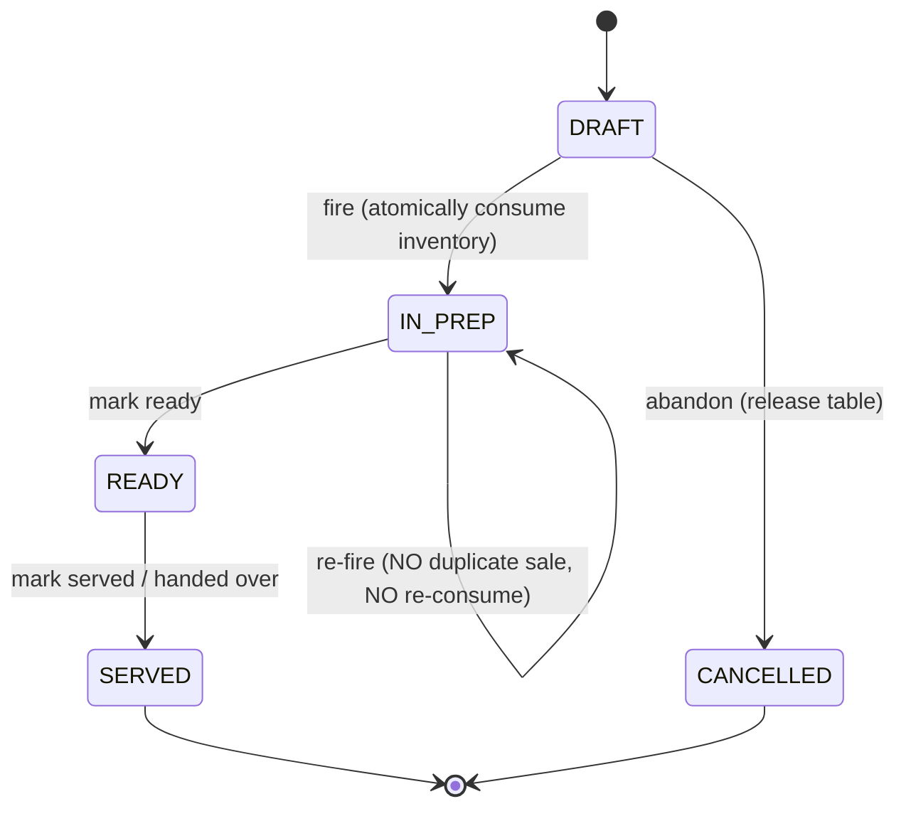
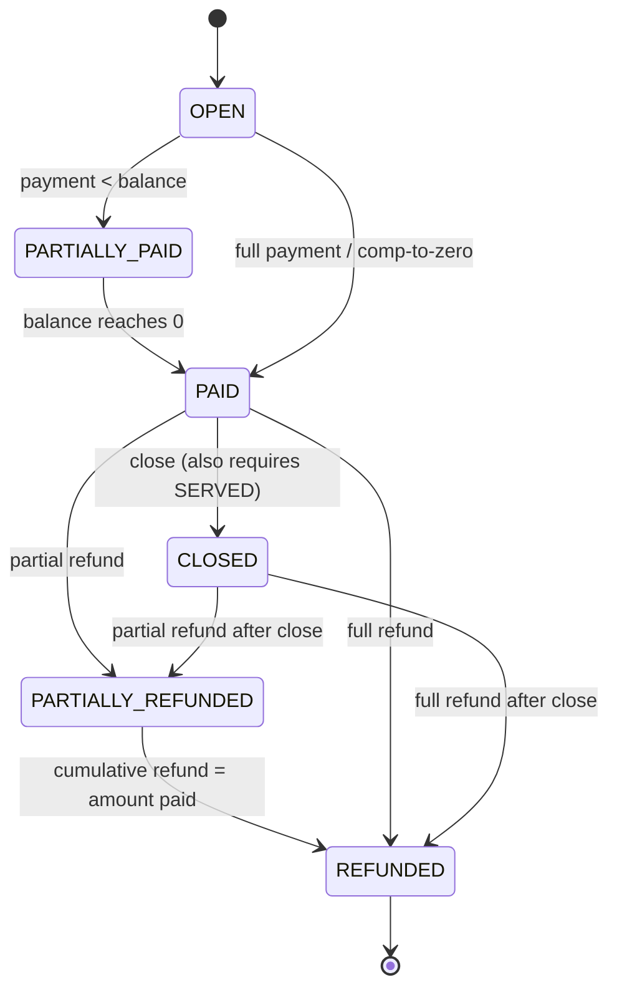
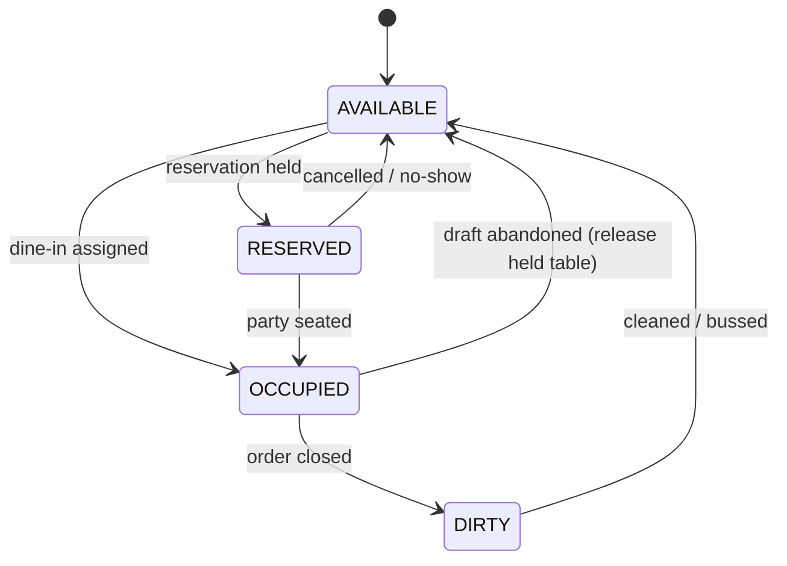
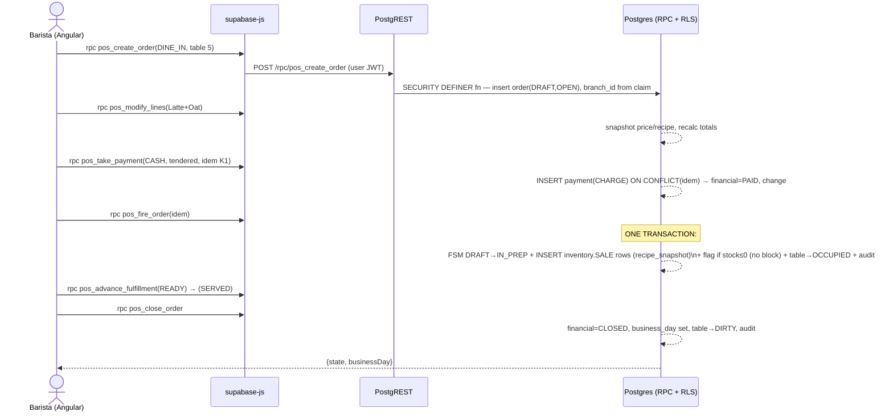
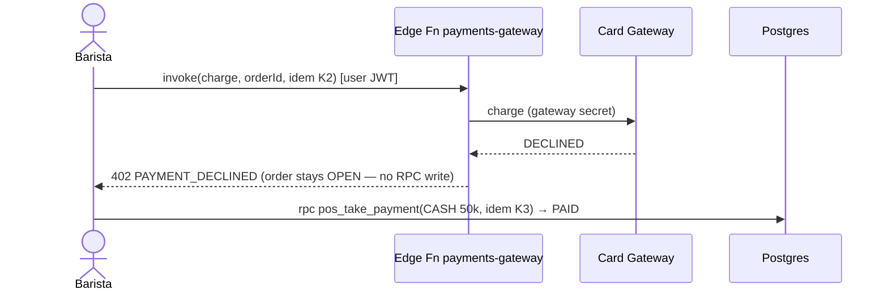

# Architecture Decision Document — POS Order Management (Supabase-Native)

> **Module:** `pos` (within a single Supabase PostgreSQL database)
> **Stack (LOCKED):** Angular SPA → **Vercel** · **Supabase Auth** (PIN/password → JWT) · **Supabase Edge Functions** (Deno/TypeScript) · **PostgreSQL RPC** (PL/pgSQL) · **Supabase PostgreSQL** with **Row-Level Security** (`branch_id` = tenant boundary, mandatory).
> **Author:** TRUNG · **Date:** 2026-06-15
> **Source of truth:** `epics.md` *locked architectural decisions* > `brainstorm.md` v1.0 where they conflict. The **domain model, two-axis FSM, money-as-minor-units, sale-time snapshotting, append-only ledgers, and idempotency keys are carried forward unchanged** from prior work; what changes here is **where the logic executes**.

> **⚠️ This document supersedes the prior Spring-Boot-first architecture.** That design is preserved verbatim as [`architecture-springboot-migration-target.md`](./architecture-springboot-migration-target.md) and is now the **target of the future migration path in §9**, not the present. The earlier doc argued *against* putting core logic in Edge Functions; this doc deliberately reverses that call because the stack is locked to a **database-centric (RPC-first) topology** where PL/pgSQL — not Java — is the home of transactional correctness. The reasoning for that reversal is in §0 and §5.

---

## 0. Senior-Architect Framing & Challenged Assumptions

The stack is locked, so framing is about **how to use it well**, not whether to use it. Five positions I am taking deliberately, with the tradeoff:

| # | Decision | Position | Why / Tradeoff |
|---|---|---|---|
| **F1** | Where does business logic live? | **PL/pgSQL RPC is the home of all transactional correctness.** Edge Functions are a thin orchestration shell, used only when SQL *can't* do the job (secrets, external HTTP, scheduling). | The POS's hard rules — FSM legality, cumulative-refund ceiling, append-only balance, atomic stock consumption — are **multi-row, transactional, single-database** operations. PL/pgSQL runs them *inside one DB transaction with zero network hops*, which is strictly safer and faster than an Edge Function issuing N round-trips. Tradeoff: business logic in SQL is harder to unit-test and refactor than Java — mitigated by pgTAP tests and the §9 migration seam. |
| **F2** | Is the outbox / eventual-consistency machinery still needed? | **No — delete it.** Inventory consumption is now just another `INSERT` *in the same RPC transaction* as the fire action. | The prior design needed an outbox because the Java tier and the DB were separate processes; a crash between them lost the consume. In a single Postgres DB, fire-order and stock-consume **commit or roll back together**. This is the single biggest simplification the locked stack buys us, and it resolves the prior doc's #1 open question (sync-vs-outbox). Tradeoff: POS and Inventory schemas are now coupled at the transaction — acceptable, they share one DB. |
| **F3** | Does Angular call Edge Functions for everything, or PostgREST/RPC directly? | **Direct `supabase-js.rpc()` for the POS hot path** (create/fire/pay/refund/close/void). Edge Functions only for gateway/webhook/secret-bearing flows. | Routing every order action through an Edge Function adds a hop, a cold-start risk, and a second place to enforce auth — for no benefit when the RPC already enforces everything under the caller's JWT. Tradeoff: the client is "closer" to the DB, so **RLS + RPC guards are the entire security boundary** — they must be airtight (they are, by design — §4/§5). |
| **F4** | RLS posture | **RLS mandatory, `branch_id` tenant key, fail-closed**, reading tenant identity from the **Supabase Auth JWT** via a single helper seam. | Locked. Reading `branch_id`/`role`/`grants` from `auth.jwt()` couples RLS to Supabase Auth *today* — accepted because the stack is locked, and isolated behind `app.current_branch_id()` so the §9 Spring Boot migration swaps one function body, not 30 policies. |
| **F5** | Trust model for sensitive grants | **JWT claims are a fast-path hint; the RPC re-checks `auth.user_grant` live** for refund/void-fired/comp. | A JWT minted before a grant was revoked must not authorize a refund. Tradeoff: one extra indexed lookup on sensitive actions — negligible, and the only honest option for money-moving operations. |

**Money:** every monetary value is `BIGINT` **minor units**. No `float`/`numeric` ever touches money (PL/pgSQL included). Ingredient quantities are `BIGINT` base units (mg/ml).

**Snapshotting:** product name, unit price, modifier surcharge, and recipe (BOM) are **copied onto the order line by the RPC at sale time**. Later catalog/recipe edits never retro-alter a historical order, its revenue, or its COGS.

---

## 1. Responsibilities

### Problems this feature solves
- Run a full trading day for **one branch** end-to-end: take orders → take money correctly → make drinks → reconcile the drawer.
- Produce **trustworthy revenue** (split/idempotent payments, reversing refunds) and **honest, atomic inventory consumption** for downstream COGS/Profit.
- Enforce **accountability**: every void/refund/comp/discount is permissioned (RLS + RPC grant check) and audited (who + why), including blocked attempts.

### What the `pos` schema + its RPCs own
- The **Order aggregate** and its two lifecycles (fulfillment + financial).
- **Payment transactions** (charges + reversing refunds) and **balance** derivation.
- **Drawer/Shift sessions** and cash reconciliation.
- **Table occupancy transitions** driven by orders (assign on dine-in, free on close).
- Writing the **inventory consumption/restoration ledger rows** (in-transaction — see F2).
- POS **audit entries** for sensitive actions.

### Explicitly NOT this feature's job
| Out of scope | Belongs to |
|---|---|
| Defining products, categories, modifiers, prices, recipes | **`catalog` schema** (POS only *reads & snapshots*) |
| Identity, PIN/password, JWT issuance, branch membership | **Supabase Auth + `auth` schema** (POS only *reads claims*) |
| Revenue/COGS/Profit dashboards | **Analytics** (reads from the ledgers/read models POS writes) |
| Receipt printing, KDS hardware, offline sync, promotions, gateway webhooks | **Epic 2** |

> **Boundary note vs the old design:** previously POS published *intent events* and Inventory owned the ledger as a separate writer. Now both live in one DB, so the **fire RPC writes the `inventory.inventory_transactions` SALE rows itself, atomically**. Inventory still *owns the schema and the rollup*, but the consume write is in-band. The seam (event names `OrderConfirmed`/`OrderRefunded`/`OrderVoided`) is retained as Realtime/trigger notifications for analytics/KDS, not as a correctness dependency.

---

## 2. Domain Model

Carried forward unchanged from prior work (the locked decisions live here); restated for self-containment.

### Aggregates & ownership
```
Order  (Aggregate Root) ─── owns ───┐
  ├─ OrderLine (1..*)          [snapshot of product @ sale]
  │     └─ OrderLineModifier (0..*) [snapshot of modifier]
  ├─ OrderAdjustment (0..*)    [comp / discount, line or order scope]
  └─ PaymentTransaction (0..*) [CHARGE or REFUND, immutable, append-only]

DrawerSession (Aggregate Root)   [independent lifecycle; cash payments reference it]
TableSeat     (owned by catalog; POS only flips status)
```

**Aggregate rule:** the **Order is the consistency boundary** — one RPC transaction loads/locks the order row (`SELECT … FOR UPDATE`) and persists all its children atomically. `DrawerSession` is a separate aggregate referenced by id.

### Entities & key attributes (summary — full DDL in [`database-design.md`](./database-design.md))

**Order** — `id, branch_id, business_day, order_type(DINE_IN|TAKEAWAY), table_id?, customer_name?, fulfillment_state, financial_state, subtotal_minor, discount_minor, total_minor, version, created_by, created_at, fired_at?, closed_at?`

**OrderLine** (snapshot) — `id, order_id, branch_id, product_id, product_name_snapshot, unit_price_minor, quantity, recipe_snapshot(jsonb), line_state(ACTIVE|VOIDED|COMPED), line_subtotal_minor`

**OrderLineModifier** (snapshot) — `id, order_line_id, branch_id, modifier_id, modifier_name_snapshot, surcharge_minor`

**OrderAdjustment** — `id, order_id, branch_id, order_line_id?, type(COMP|DISCOUNT_PCT|DISCOUNT_AMT), value, resulting_discount_minor, reason, authorized_by, created_at`

**PaymentTransaction** (append-only money ledger of the order) — `id, order_id, branch_id, drawer_session_id?(cash), kind(CHARGE|REFUND), method(CASH|CARD|QR), amount_minor(>0, sign in kind), tendered_minor?, change_minor?, idempotency_key UNIQUE, reason?, actor, created_at`

**DrawerSession** — `id, register_id, branch_id, opened_by, opening_float_minor, opened_at, closed_at?, counted_cash_minor?, expected_cash_minor?, variance_minor?, state(OPEN|CLOSED), note?`

### Classification (explicit)
| Classification | Members | Rationale |
|---|---|---|
| **Aggregate roots** | `Order`, `DrawerSession` | Each is a consistency boundary; cross-aggregate refs by **id only**. |
| **Entities** (inside Order) | `OrderLine`, `OrderLineModifier`, `OrderAdjustment`, `PaymentTransaction` | Identity + lifecycle, but no independent existence outside an Order. |
| **Value objects** | `Money(amountMinor)`, `PriceSnapshot`, `RecipeSnapshot`, `IdempotencyKey`, `BusinessDay`, `Variance`, and the enums | Immutable, compared by value. In a DB-centric world these are *column conventions + the `_minor` suffix discipline*, not classes — the §9 migration re-materializes them as Java VOs. |

> **Derived-vs-stored tradeoff:** `subtotal/discount/total_minor` are a **persisted cache** for list queries; **financial-state transitions always recompute `balance = Σ(CHARGE) − Σ(REFUND)` from `payment_transactions`**, never trusting the cache. The cache is an index, not a source of truth.

---

## 3. State Machines

Two **orthogonal** axes (the locked rejection of the single linear `brainstorm.md §8` chain). A single axis cannot express *served-but-unpaid* (table service) or *paid-but-not-made* (pay-first). **Transition legality is enforced inside each RPC** (a guard clause per axis), optionally backstopped by a trigger (§3.5).

### 3.1 Fulfillment state

**Valid:** DRAFT→IN_PREP, DRAFT→CANCELLED, IN_PREP→READY, READY→SERVED, IN_PREP→IN_PREP. **Rejected:** any backward move, SERVED→*, CANCELLED→*, skips (DRAFT→READY), CANCELLED of a fired order (use void/refund + restore).

### 3.2 Financial state

**Rejected:** any refund while OPEN/PARTIALLY_PAID (nothing captured → it's a **void**), cumulative refunds **exceeding** amount paid, CLOSE while balance > 0 and not comped-to-zero, a second CHARGE after PAID.

> **Two-axis tradeoff:** 16 nominal combinations, but most are unreachable; the RPCs guard *transitions*, not the cartesian product. Payoff: pay-first (`PAID + DRAFT`) and table-service (`SERVED + OPEN`) fall out with zero special-casing.

### 3.3 Table occupancy

POS *drives* these transitions **inside the same RPC transaction** as the triggering order action (assign-on-fire, free-on-close). One active dine-in order per table is guaranteed by the partial unique index `uq_table_active_order`. `RESERVED` is modeled but exercised only in Epic 2+.

### 3.4 Drawer session
`[*]→OPEN→CLOSED`. Invariant: **at most one OPEN session per register** (partial unique index `uq_one_open_drawer`). Cash payments/refunds may only attach to an OPEN session (DB CHECK + RPC guard).

### 3.5 Where the FSM is enforced (and an optional DB backstop)
- **Primary:** each mutating RPC starts with `SELECT … FOR UPDATE` on the order, then a `CASE`-based guard: *"is `(current_state → requested_state)` a legal edge?"* — if not, `RAISE EXCEPTION 'INVALID_STATE'`. One guard helper per axis (`pos.assert_fulfillment_transition(from, to)`, `pos.assert_financial_transition(from, to)`), reused by every RPC so the matrix lives in exactly one place and is pgTAP-tested.
- **Optional backstop (recommended for defense-in-depth):** a `BEFORE UPDATE` trigger on `pos.orders` that rejects any `(old.fulfillment_state, new.fulfillment_state)` / financial pair not in the legal set. Catches a buggy/rogue RPC. Kept *optional* because it duplicates the guard; if adopted, it is generated from the same edge table.

---

## 4. RLS Strategy

RLS is the **mandatory, database-enforced tenant boundary**, keyed on `branch_id`, **fail-closed**. It protects every direct PostgREST read the Angular client makes via `supabase-js`. Mutations go through SECURITY DEFINER RPCs (§5) that *additionally* re-assert tenant + grants.

### 4.1 Identity source — Supabase Auth JWT, behind one seam
Supabase Auth issues the JWT. A **Custom Access Token Hook** (a Postgres function registered with Supabase Auth) injects the user's `branch_id`, `role`, and `grants[]` into the token from `auth.user_account` / `auth.user_grant` at sign-in and refresh. RLS reads them through a **single helper** so the coupling to Supabase Auth is isolated to one function:

```sql
-- The ONLY place that knows tenant identity comes from a Supabase JWT.
-- §9 migration swaps the body to current_setting('app.current_branch') and nothing else changes.
CREATE OR REPLACE FUNCTION app.current_branch_id() RETURNS uuid
LANGUAGE sql STABLE AS $$
  SELECT NULLIF(auth.jwt() ->> 'branch_id', '')::uuid
$$;

CREATE OR REPLACE FUNCTION app.is_admin() RETURNS boolean
LANGUAGE sql STABLE AS $$
  SELECT COALESCE(auth.jwt() ->> 'role', '') = 'ADMIN'
$$;
```

### 4.2 Policy template (applied to every tenant table)
```sql
ALTER TABLE pos.orders ENABLE ROW LEVEL SECURITY;
ALTER TABLE pos.orders FORCE  ROW LEVEL SECURITY;   -- applies even to the table owner

CREATE POLICY orders_tenant_read ON pos.orders
  FOR SELECT USING (
        app.is_admin()                              -- admin cross-branch oversight (US-21)
     OR branch_id = app.current_branch_id()
  );

-- Direct client writes are DENIED (no FOR INSERT/UPDATE/DELETE policy + REVOKE below).
-- All writes flow through SECURITY DEFINER RPCs, so the write surface is the RPC, not the table.
```
Applied to `pos.orders`, `pos.order_lines`, `pos.order_line_modifiers`, `pos.order_adjustments`, `pos.payment_transactions`, `pos.drawer_sessions`, `pos.audit_entries`, `inventory.inventory_transactions`, `catalog.table_seat`. Child tables carry a **denormalized `branch_id`** (decision D4, set by the RPC at insert) so each policy is a flat indexed predicate, not a subquery to the parent.

### 4.3 Role & grant model
| Postgres role | Who | Rights |
|---|---|---|
| `anon` | unauthenticated | nothing on `pos`/`inventory`; only the login Edge Function path |
| `authenticated` | any signed-in Supabase user | `SELECT` via RLS on tenant tables; **`EXECUTE` on POS RPCs**; **no direct INSERT/UPDATE/DELETE** (`REVOKE`d) |
| `pos_definer` (RPC owner) | the role SECURITY DEFINER RPCs run as | `INSERT/SELECT` on POS tables; **no UPDATE/DELETE on append-only tables** (so even a buggy RPC can't mutate history — §6 trigger is the final backstop) |
| `service_role` | migration CI / trusted backfills **only** | bypasses RLS — **never reachable from the browser**, never used for user traffic |

> **RLS tradeoff & the #1 foot-gun:** the entire isolation model collapses if (a) the client ever gets the `service_role` key (it bypasses RLS) or (b) a write path skips the RPC and is granted direct table DML. Mitigations: `service_role` key lives only in CI/Edge-Function secrets, never shipped to the SPA; `authenticated` is `REVOKE`d from table DML so the *only* write path is an RPC; a boot-time/integration assertion verifies `authenticated` cannot `INSERT` into `pos.orders` directly.

### 4.4 What RLS does **not** guard (and what does)
RLS guards **which rows** a tenant can see/touch. It **cannot** express FSM legality, the cumulative-refund ceiling, or append-only-ness — those are **multi-row/temporal** and live in the **RPC body** (§5) and the §6 triggers. Document this so no one assumes "RLS on = the DB is safe" and skips the RPC guards.

---

## 5. RPC vs Edge Function Responsibilities

This is the defining decision of the Supabase-native design. **Default to PL/pgSQL RPC; reach for an Edge Function only when SQL structurally cannot do the job.**

### 5.1 The decision rule
```
Does the operation need ANY of:
  • outbound HTTP to a third party (payment gateway, SMS, webhook callback)?
  • a secret the browser must never hold (gateway API key, service_role)?
  • non-transactional orchestration across systems / scheduled execution?
  • heavy non-relational compute (PDF/receipt render, image work)?
        │
   ┌────┴────┐
  YES        NO
   │          │
Edge Fn   PostgreSQL RPC   ◄── the POS hot path lives here
(thin)    (SECURITY DEFINER, one transaction, all the rules)
```

### 5.2 PostgreSQL RPC (PL/pgSQL) — the home of correctness
Every POS state change is **one `SECURITY DEFINER` function = one transaction**. The function: locks the order (`FOR UPDATE`), reads identity via `app.current_branch_id()`/claims, re-checks grants live where needed, runs the FSM guard, performs all writes (order + children + payment + **inventory ledger** + audit), and returns the new state as JSON.

| RPC | Does (atomically, in one txn) |
|---|---|
| `pos_create_order(...)` | insert order(DRAFT,OPEN) + snapshot first lines; stamp `branch_id` from claims |
| `pos_modify_lines(order_id, ...)` | DRAFT-only line add/change/remove + recalc totals (re-snapshot price/recipe from catalog) |
| `pos_fire_order(order_id, idem)` | FSM DRAFT→IN_PREP **+ insert `inventory.SALE` rows from `recipe_snapshot` + flag (not block) if stock ≤ 0** + assign table OCCUPIED + audit |
| `pos_take_payment(order_id, method, amount, tendered?, idem)` | insert `payment_transaction(CHARGE)` (idempotent), recompute balance, advance financial state, compute change; cash requires OPEN drawer |
| `pos_refund(order_id, lines?/amount?, method, reason, idem)` | **live `REFUND` grant check** → cumulative-refund-≤-paid check under `FOR UPDATE` → insert `payment_transaction(REFUND)` + **restore inventory** for refunded lines + audit |
| `pos_void(order_id, target, reason)` | unpaid-only; remove/flag line/order, recalc; if already fired → restore inventory; audit (grant `VOID_FIRED` if fired) |
| `pos_adjust(order_id, comp/discount, reason)` | live `COMP_DISCOUNT` grant check → insert adjustment + recalc; audit |
| `pos_advance_fulfillment(order_id, to)` | FSM IN_PREP→READY→SERVED, or re-fire (no re-consume) |
| `pos_close_order(order_id)` | require PAID(or comped-to-zero)+SERVED → financial→CLOSED + set `business_day` (branch cutoff) + table→DIRTY + audit |
| `pos_open_drawer(register_id, float)` | insert OPEN session (partial unique index enforces one-open-per-register) |
| `pos_close_drawer(session_id, counted)` | expected = float + Σcash charges − Σcash refunds; variance; state→CLOSED; audit |

**Why RPC wins here:** all of these are *single-database, multi-row, transactional* operations. In PL/pgSQL they execute with **zero network round-trips inside the transaction**, so a pessimistic `SELECT … FOR UPDATE` on the order row is cheap and correct — no optimistic-retry dance needed. Idempotency uses `INSERT … ON CONFLICT (idempotency_key) DO NOTHING RETURNING …`; a duplicate returns the original transaction, never a second charge.

### 5.3 Edge Functions (Deno/TypeScript) — the orchestration shell
Used only for what the DB shouldn't or can't do:

| Edge Function | Why it can't be an RPC |
|---|---|
| `payments-gateway` (Epic 2) | calls an **external** card/QR provider over HTTPS, holds the **gateway secret**, then calls `pos_take_payment` RPC to record the captured result. SQL must not make outbound HTTP on the hot path. |
| `payments-webhook` (Epic 2) | receives async gateway callbacks (verifies signature with a secret), reconciles, calls an RPC. Public endpoint with custom auth, not a user JWT. |
| `daily-rollup` / `stale-draft-cleanup` (scheduled) | cron-triggered maintenance (promote `current_stock` rollup, expire abandoned DRAFTs) running as a trusted role. |
| `receipt-render` (future) | produces a PDF/image — non-relational compute, not SQL's job. |
| `auth-custom-claims` hook | the Supabase Auth access-token hook that injects `branch_id`/`role`/`grants` (a DB function registered with Auth; conceptually the auth seam). |

**Edge Functions never re-implement order/payment rules** — they validate transport, attach secrets, and *delegate to the RPCs*. This keeps a single source of truth for correctness.

### 5.4 Client → backend call paths
```
Angular (supabase-js, user JWT)
   ├─ hot path:      .rpc('pos_fire_order', {...})           → PostgREST → PL/pgSQL  (RLS+RPC enforce all)
   ├─ reads/lists:   .from('orders').select(...)             → PostgREST → RLS-filtered rows
   └─ gateway path:  .functions.invoke('payments-gateway')   → Edge Fn → (gateway) → .rpc('pos_take_payment')
```

> **Tradeoff — "two languages" cost:** correctness logic in PL/pgSQL plus orchestration in TypeScript means two runtimes and two test setups (pgTAP + Deno test). Accepted because the alternative — pushing transactional rules into Edge Functions — would require multi-statement transactions over the network (Supabase Edge Functions cannot hold a DB transaction across multiple PostgREST calls), which is exactly the correctness hole F1 avoids. The RPC is the only place that can hold the transaction, so it must own the rules.

---

## 6. Append-Only Enforcement & Audit (carried forward, runs in-DB)

Unchanged from `database-design.md` §6 — and it runs *better* here because the writers are now in-DB RPCs:

- **Privilege:** `REVOKE UPDATE, DELETE, TRUNCATE` on `pos.payment_transactions`, `inventory.inventory_transactions`, `pos.audit_entries` from both `authenticated` and `pos_definer`. RPCs only `INSERT`.
- **Trigger backstop:** `BEFORE UPDATE OR DELETE → pos.forbid_mutation()` raises on any mutation, surviving even a buggy SECURITY DEFINER path.
- **Three distinct logs:** `payment_transactions` (what money moved) · `inventory_transactions` (what stock moved) · `audit_entries` (who did a sensitive thing, and why — **including BLOCKED attempts**, US-17).
- **Blocked-attempt audit:** a rejected refund/void must still be recorded even though its RPC transaction aborts. PL/pgSQL pattern: catch the authorization failure, write the BLOCKED audit row via a **`SECURITY DEFINER` helper invoked through `dblink`/`pg_background` or an autonomous-style separate connection**, then re-raise. *(PL/pgSQL has no native autonomous transaction; the pragmatic MVP choice is to have the Edge/RPC caller catch the typed error and call a tiny `pos_log_blocked_attempt` RPC in its own transaction — documented as the §9-portable equivalent of Spring's `REQUIRES_NEW`.)*

> **Tradeoff:** the lack of native autonomous transactions in PL/pgSQL makes "log the blocked attempt" slightly awkward versus Spring's `REQUIRES_NEW`. The two-call pattern (reject → caller logs) is the honest workaround and is called out as a known wrinkle, not hidden.

---

## 7. Sequence Diagrams

### 7.1 Happy path — Dine-in, pay-first, fire (atomic consume), serve, close

*Contrast with the old design:* there is **no outbox, no relay, no eventual consistency** — fire and stock-consume commit together (F2).

### 7.2 Make-before-pay (table service) + split payment
Order fired and served while **`SERVED + OPEN`** (a first-class combination); customer then pays 60k CARD + 40k CASH via two `pos_take_payment` calls; balance hits 0 → `PAID`; then `pos_close_order`. Demonstrates orthogonal axes with no special-casing.

### 7.3 Take payment — idempotent, with change, cash-needs-drawer
```mermaid
sequenceDiagram
    actor B as Barista
    participant PG as Postgres (pos_take_payment RPC)
    B->>PG: rpc pos_take_payment(CASH, amount, tendered, idem K1)
    PG->>PG: BEGIN (implicit) ; SELECT order FOR UPDATE
    PG->>PG: assert method=CASH ⇒ OPEN drawer for register (else RAISE NO_OPEN_DRAWER)
    PG->>PG: INSERT payment(idem=K1) ON CONFLICT(idempotency_key) DO NOTHING
    alt conflict (retry/replay)
        PG->>PG: SELECT original row by K1
        PG-->>B: original result (NO double charge)
    else first time
        PG->>PG: balance = Σcharge − Σrefund − total ; financial = PARTIALLY_PAID|PAID
        PG-->>B: {financialState, balanceMinor, changeMinor}
    end
```

### 7.4 Refund — live grant check, ceiling, reversing row, atomic stock restore
```mermaid
sequenceDiagram
    actor M as Manager
    participant PG as Postgres (pos_refund RPC)
    M->>PG: rpc pos_refund(lineIds, method, reason, idem R1)
    PG->>PG: SELECT order FOR UPDATE
    PG->>PG: EXISTS(auth.user_grant WHERE user=actor AND grant='REFUND')?  (live, not JWT)
    alt no grant
        PG->>PG: log BLOCKED attempt (separate call) ; RAISE NO_REFUND_GRANT
        PG-->>M: 403-equivalent error
    else granted
        PG->>PG: Σrefund + this ≤ amount paid?  (else RAISE EXCEEDS_REFUNDABLE{max})
        PG->>PG: INSERT payment(REFUND, idem=R1) + financial=PARTIALLY_REFUNDED|REFUNDED
        PG->>PG: INSERT inventory restore rows for refunded lines + audit
        PG-->>M: {refundId, financialState, refundedTotalMinor}
    end
```

### 7.5 Close drawer — reconciliation
```mermaid
sequenceDiagram
    actor B as Barista
    participant PG as Postgres (pos_close_drawer RPC)
    B->>PG: rpc pos_close_drawer(session_id, countedCashMinor)
    PG->>PG: SELECT session FOR UPDATE (assert OPEN, owned/manager)
    PG->>PG: expected = float + Σ(CASH charge) − Σ(CASH refund) on session
    PG->>PG: variance = counted − expected ; state=CLOSED ; audit
    PG-->>B: {expectedCashMinor, countedCashMinor, varianceMinor}
    Note over PG: 2nd close → ALREADY_CLOSED ; 2nd open on register → partial-unique-index reject
```

### 7.6 Failure — declined card via gateway Edge Function (Epic 2)


---

## 8. Multi-Branch Strategy

- **Every transactional row carries `branch_id`** (orders + denormalized onto all children, payments, drawers, audit, inventory). It is **stamped by the RPC from the JWT claim**, never accepted from a client parameter. The sole exception is **Admin** cross-branch *read* (US-21) via `app.is_admin()` in the read policy.
- **RLS is the primary boundary** (§4); the RPC re-asserting `branch_id` on write is defense-in-depth. A forgotten predicate can no longer leak across branches because the DB rejects it.
- **No cross-branch mutation** — you cannot fire/pay/refund across branches; only Admin read. `WITH CHECK`/RPC stamping forbid writing another branch's row even for admins.
- **Branch-scoped invariants:** one OPEN drawer per register; stock is per branch; the **business-day cutoff is per-branch** (`auth.branch.business_day_cutoff`, e.g. 04:00) applied by `pos_close_order` when bucketing revenue.
- **Scale path:** `branch_id` is effectively a **tenant key**; range/hash-partition `pos.orders` and `inventory.inventory_transactions` by `branch_id` when volume justifies (NFR: 100+ branches, 1M+ orders). No model change required.

> **Tradeoff:** shared schema + `branch_id` column (chosen) makes cross-branch reporting trivial and ops simple, at the cost of leaning on RLS discipline for isolation. Schema-per-branch would give hard isolation but painful roll-up reporting and migration fan-out — rejected for a single-owner 100-branch business.

---

## 9. Future Migration Path → Spring Boot

The locked stack is Supabase-native **today**; §9 is the credible exit. The migration target is exactly the preserved [`architecture-springboot-migration-target.md`](./architecture-springboot-migration-target.md). The system is built so the move is **incremental and low-risk**, because the *schema and rules are already specified portably*.

### 9.1 What is already portable (no change on migration)
- **The entire schema** — plain Postgres, `text+CHECK` enums, append-only triggers, `bigint` minor units. Supabase *is* Postgres; point Spring Data JPA at the same DB.
- **The domain model, two-axis FSM, money/snapshot/idempotency rules** — re-expressed as Java services that run the *same* logic the RPCs run.
- **Append-only enforcement** (REVOKE + triggers) — runs identically.

### 9.2 What is Supabase-coupled (the seams to cut)
| Coupling | Migration action |
|---|---|
| RLS reads `auth.jwt()` claims | swap the body of `app.current_branch_id()`/`app.is_admin()` to `current_setting('app.current_branch')`; Spring sets `SET LOCAL app.current_branch` per transaction from its own validated JWT. **Policies unchanged.** |
| Business logic in PL/pgSQL RPCs | **Strangler-fig:** stand up the Spring tier in front; move one RPC's logic into a `@Transactional` Java service at a time, calling the *same* SQL/locks. The RPC and the Java service are line-for-line equivalent because both are specified in §5. Run them side-by-side, cut over per endpoint. |
| Supabase Auth (JWT issuer) | implement the `AuthProvider` port with a `SupabaseAuthAdapter` first (verify Supabase JWT) → later a `PinJwtAdapter` (Spring Security). `auth.user_account` keeps `external_auth_id` so identities survive the swap. |
| `supabase-js` in Angular | replace the data layer with a REST `HttpClient` service hitting the Spring API (`/api/pos/...`). Component/UI code unaffected if the data service is behind an interface. |
| Edge Functions (gateway/webhook/cron) | become Spring `@RestController` + `@Scheduled` beans. |
| PostgREST as the API | replaced by Spring controllers; **drop direct client table access** and rely solely on the service tier (RLS remains as defense-in-depth). |

### 9.3 Migration sequencing (strangler-fig, reversible at each step)
1. **Auth port first** — formalize `AuthProvider`; nothing else moves. 2. **Read endpoints** — Spring serves `GET /orders…` (RLS still enforces); Angular switches reads. 3. **One write RPC at a time** — fire, then pay, then refund… each becomes a Java `@Transactional` service; feature-flag the client to the new path; keep the RPC until the cutover proves out. 4. **Edge Functions → Spring** beans. 5. **Remove PostgREST/`supabase-js`**. 6. **(Optional) leave Supabase as managed Postgres** or move to self-hosted PG — schema is identical.

> **Why this is safe:** every business rule has a *single, written specification* (§3/§5) that both the PL/pgSQL RPC and the future Java service implement. The migration is "re-host the same rule," not "rediscover the rules." The DB never moves; only the code that fronts it does.

---

## 10. Failure Scenarios & Tradeoffs

| Scenario | Behavior | Mitigation | Residual tradeoff |
|---|---|---|---|
| Crash mid-`pos_fire_order` | nothing commits — order stays DRAFT, **no orphan stock consume** | single-transaction RPC (F2) | none — this is the win over the old outbox model |
| **Duplicate payment** (retry/double-tap) | only one charge | `idempotency_key` UNIQUE + `ON CONFLICT` in RPC | client must persist the key |
| **Concurrent edits** to one order | serialized | `SELECT … FOR UPDATE` in the RPC (cheap, in-DB) | tiny lock wait; far simpler than optimistic retry |
| **Two opens** on one register | second rejected | partial unique index | none |
| **Digital payment declined** | order stays OPEN, retriable | gateway Edge Fn returns 402, **no RPC write** | manual retry |
| **Over-refund** (cumulative > paid) | rejected, shows max | in-RPC check under `FOR UPDATE` | none |
| **Negative theoretical stock** | sale completes, flagged | RPC inserts SALE then flags if ≤0 — never blocks (US-24) | reconcile by physical count |
| **`service_role` key leaks to browser** | **total RLS bypass** (critical) | key only in CI/Edge secrets; SPA ships only `anon` key; boot assertion that `authenticated` lacks table DML | configuration discipline — the #1 risk |
| **Custom-claims hook fails / stale claim** | RLS denies (fail-closed) on missing `branch_id`; refund denied on stale grant (live re-check) | `current_setting(...,true)` → NULL → deny; RPC re-checks grants live | a just-revoked user may keep *read* access until token refresh (≤ token TTL) |
| **Edge Function cold start / timeout** | gateway call slow | keep hot path off Edge Fns (F3); idempotency makes retry safe | Epic-2 paths only |
| **PostgREST exposes a table without RLS** | potential leak | CI check: every `pos`/`inventory` table has `ENABLE + FORCE` RLS; deny-by-default | must be tested, not assumed |
| **Clock skew near business-day cutoff** | wrong day bucket | server `now()` + branch cutoff in `pos_close_order` | none material |

---

## 11. Self-Critique (challenge before finalizing)

Honest weaknesses, with what I'd change:

1. **RPC logic is harder to test and evolve than Java.** PL/pgSQL has weaker tooling, no real debugger in CI, and refactors are riskier. **Mitigation:** mandate **pgTAP** unit tests for every RPC (especially the FSM guard matrix and the refund ceiling), and keep each RPC small and single-purpose. This is the cost of F1 and the strongest argument *for* the §9 migration once the business outgrows it.
2. **No native autonomous transaction for blocked-attempt audit.** The "reject → caller logs BLOCKED" two-call pattern (§6) is clumsier than Spring's `REQUIRES_NEW` and risks a missed audit row if the client doesn't make the second call. **Recommendation:** centralize the catch in a thin wrapper RPC or the Edge layer so the second call isn't optional. *Resolve before build.*
3. **Security boundary is "thinner" — the client talks almost directly to the DB.** With F3, RLS + RPC guards are the *entire* perimeter; there is no app tier to add a second opinion. This is fine **only if** RLS is `FORCE`d everywhere, `authenticated` has zero direct DML, and `service_role` never leaks. Those are *configuration* invariants the schema can't self-enforce — they must be CI-asserted and pen-tested. **This is the one area I'd want a security review before go-live.**
4. **Dual source of truth on totals** (cached `total_minor` vs derived balance) — carried over; mitigated by always recomputing from `payment_transactions` for transitions. A Postgres **generated column / view** would be cleaner; the smell remains.
5. **Claims freshness.** Branch/role/grants in the JWT are only as fresh as the last token refresh. Live re-check covers *money* actions (refund/void/comp); but a user moved between branches keeps stale *read* access until refresh. Acceptable for an internal tool; documented, not hidden.
6. **`recipe_snapshot` as jsonb** is perfect for COGS immutability but useless for relational consumption analytics — acceptable only because `inventory.inventory_transactions` is the queryable consumption source.
7. **Two-language cognitive load.** Devs must be fluent in PL/pgSQL *and* Deno/TS *and* Angular. For a small team this is real friction; the §9 path exists partly to collapse back to one backend language when that friction outweighs the infra savings.
8. **`RESERVED` table state & `Money` currency field** — latent YAGNI carried from the brief; flagged, harmless, don't build logic on them.
9. **Comp-to-zero close authorization** — which grant authorizes closing an unpaid, fully-comped order — is still unresolved (Appendix #5). A real gap, not a detail.

**Verdict:** the design is sound and a *genuinely better fit* for the locked stack than a naive port of the Spring design would be — the single-transaction RPC for fire+consume (F2) is a real correctness upgrade, and §9 keeps the exit open. The risks are concentrated in **configuration discipline** (item 3) and **PL/pgSQL testing rigor** (item 1), not in the model. Before building Epic 1, resolve **(2) blocked-attempt audit pattern** and **(9) comp-to-zero authorization**, and commit to the **RLS/role CI assertions** in item 3.

---

## Appendix — Open decisions to confirm

### Resolved (2026-06-17, ratified by TRUNG via `bmad-prd`/correct-course session)
- **[RESOLVED] Blocked-attempt audit mechanism (was #1):** **Edge Function wrapper, two-call pattern.** The sensitive RPC raises a typed error; a thin Edge Function catches it and calls `pos_log_blocked_attempt` in its own transaction, so the BLOCKED audit row survives the rejected action's rollback. Centralized so the second call is never optional; line-for-line portable to Spring's `REQUIRES_NEW` at §9. *(Resolves self-critique §11-2; affects S-06/S-21/S-22/S-23.)*
- **[RESOLVED] Comp-to-zero close authorization (was #3):** **Reuse the `COMP_DISCOUNT` grant.** The comp that drove the balance to zero already required `COMP_DISCOUNT`; closing a zero-balance order adds no new money risk, so no new grant is introduced. *(Resolves self-critique §11-9; affects S-20/S-23.)*
- **[RESOLVED] Inventory consume timing:** **In-transaction (per §F2).** Fire + `inventory.SALE` write commit or roll back together in one RPC transaction — no outbox, no eventual consistency. Formally closes the story-breakdown open item; affects S-13/S-14.

### Still open
1. **Hot-path topology** — confirm direct `supabase-js.rpc()` for POS actions (F3) vs routing through Edge Functions. *(Recommend: direct RPC; Edge only for gateway/webhook/cron.)*
2. **Smallest money unit for VND** — whole đồng, or ×100 for safety/foreign tender?
3. **Business-day cutoff** — confirmed per-branch in `auth.branch.business_day_cutoff` (e.g. 04:00); where is it administered?
4. **Realtime for the ticket board** — adopt Supabase Realtime now (behind a subscription abstraction) or poll the partial-index query for MVP?

---

_Authored in one pass to the requested 9-section structure (domain model · state machines · database design · RLS · RPC-vs-Edge · sequences · multi-branch · failures · Spring Boot migration) plus framing and self-critique. Pairs with [`database-design.md`](./database-design.md) (canonical schema + RLS DDL). Next concrete artifact: the Supabase CLI migration set under `supabase/migrations/` — `<ts>_auth_catalog.sql`, `<ts>_inventory_ledger.sql`, `<ts>_pos_*.sql`, `<ts>_rls_policies.sql`, `<ts>_pos_rpcs.sql` — all plain Postgres, all portable to the §9 Spring Boot target._
