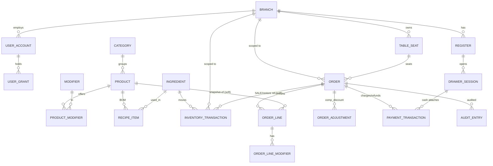

# Database Design — Multi-Branch Coffee Shop Management System

> **Scope:** database design only (ERD, DDL, constraints, enums, snapshots, audit, append-only). Centered on **POS Order Management** with the **Inventory ledger**, **Catalog**, and **Auth** tables it depends on.
> **Engine:** **Supabase PostgreSQL (managed)** — treated as plain Postgres; schema is vanilla SQL and **portable to self-hosted PostgreSQL**. **Migrations:** **Supabase CLI** (timestamped plain-SQL files), not Flyway. **Tenant isolation:** **Row Level Security (RLS)** keyed on `branch_id` (see §8.5). **Source of truth:** `epics.md` locked decisions override `brainstorm.md`.

---

## 0. Conventions & Global Decisions

| Decision | Rule | Rationale / Tradeoff |
|---|---|---|
| **Identifiers** | `uuid` PK, default `gen_random_uuid()` (pgcrypto). | Client-generatable → enables offline capture & idempotency later. Tradeoff: 16B vs 8B bigint, random-insert index churn — acceptable; use `uuidv7`-style if churn bites. |
| **Money** | `BIGINT` **minor units**, never `float`/`numeric` for currency. Column suffix `_minor`. | Exact arithmetic; forbids rounding drift. |
| **Ingredient quantities** | `BIGINT` in the ingredient's **base unit** (e.g. milligrams, millilitres) — integer, never float. | Same no-float principle for stock math. |
| **Timestamps** | `timestamptz`, server-authoritative (`now()`), UTC stored. | Multi-branch + business-day correctness. |
| **Enums** | `text` + `CHECK` constraint (not native PG `ENUM`). | CHECK is trivially altered by migration; native enums are painful to reorder/remove. Tradeoff: no type-level reuse — mitigated by documenting value sets in §2. |
| **Cross-module FKs** | Hard FKs **within** a schema; **logical (no FK)** across schema boundaries (e.g. `pos.orders.branch_id`). | Preserves modular-monolith independence + independent migration. Tradeoff: referential integrity across modules is an app invariant. |
| **Schemas** | `auth`, `catalog`, `inventory`, `pos`. | Module isolation in one database. |
| **Append-only tables** | `pos.payment_transactions`, `inventory.inventory_transactions`, `pos.audit_entries` — no UPDATE/DELETE. | Financial/stock/accountability truth; corrections are new reversing rows. Enforced by `REVOKE` **and** a trigger (§6). |
| **Snapshots** | name/price/surcharge/recipe copied onto the order line at sale time (§5). | Catalog/recipe edits never mutate history, revenue, or COGS. |
| **Platform** | Supabase = managed Postgres + services. No Supabase-only SQL (`auth.uid()`, storage, `pg_net`) in core schema/migrations. | Keeps schema portable to self-hosted Postgres. |
| **Tenant isolation** | **RLS** enabled + `FORCE`d on tenant tables; `branch_id` is the policy key (§8.5). App tier sets `SET LOCAL app.current_branch` per **transaction**. | DB-enforced, not app-trust. |
| **DB roles** | App connects with a **non-bypass** role (subject to RLS). Supabase `service_role` (RLS-bypass) is **only** for migration CI/admin backfills. | One misuse of `service_role` silently defeats tenant isolation. |
| **Migrations** | Supabase CLI plain-SQL files under `supabase/migrations/`; RLS policies shipped in migrations. | Vanilla-Postgres = portable. |

---

## 1. ERD



> Solid relationships are hard FKs within a schema. The two `snapshot-of`/`ref` edges to `PRODUCT`/`ORDER` from `ORDER_LINE`/`INVENTORY_TRANSACTION` are **soft** (id only, no FK) because they cross module boundaries and/or must survive the referenced row changing.

---

## 2. State Enums (canonical value sets)

All stored as `text` with `CHECK`. Single source of truth for allowed values:

| Enum | Column(s) | Values | Notes |
|---|---|---|---|
| **OrderType** | `pos.orders.order_type` | `DINE_IN`, `TAKEAWAY` | DINE_IN ⇒ table required |
| **FulfillmentState** | `pos.orders.fulfillment_state` | `DRAFT`, `IN_PREP`, `READY`, `SERVED`, `CANCELLED` | §3.1 of architecture |
| **FinancialState** | `pos.orders.financial_state` | `OPEN`, `PARTIALLY_PAID`, `PAID`, `CLOSED`, `PARTIALLY_REFUNDED`, `REFUNDED` | orthogonal to fulfillment |
| **LineState** | `pos.order_lines.line_state` | `ACTIVE`, `VOIDED`, `COMPED` | voided/comped excluded from revenue |
| **AdjustmentType** | `pos.order_adjustments.type` | `COMP`, `DISCOUNT_PCT`, `DISCOUNT_AMT` | |
| **PaymentKind** | `pos.payment_transactions.kind` | `CHARGE`, `REFUND` | refund = reversing row, not status flip |
| **PaymentMethod** | `pos.payment_transactions.method` | `CASH`, `CARD`, `QR` | CASH ⇒ drawer session required |
| **DrawerState** | `pos.drawer_sessions.state` | `OPEN`, `CLOSED` | one OPEN per register |
| **TableStatus** | `catalog.table_seat.status` | `AVAILABLE`, `OCCUPIED`, `RESERVED`, `DIRTY` | POS drives transitions |
| **InventoryTxnType** | `inventory.inventory_transactions.txn_type` | `PURCHASE`, `SALE`, `ADJUSTMENT`, `WASTE`, `TRANSFER_IN`, `TRANSFER_OUT` | append-only ledger |
| **AuditOutcome** | `pos.audit_entries.outcome` | `OK`, `BLOCKED` | BLOCKED = rejected attempt (US-17) |

---

## 3. Table Definitions (DDL)

### 3.1 `auth` schema
```sql
CREATE SCHEMA IF NOT EXISTS auth;

CREATE TABLE auth.branch (
    id            uuid PRIMARY KEY DEFAULT gen_random_uuid(),
    name          text NOT NULL,
    business_day_cutoff time NOT NULL DEFAULT '04:00',  -- per-branch business-day boundary
    active        boolean NOT NULL DEFAULT true,
    created_at    timestamptz NOT NULL DEFAULT now()
);

CREATE TABLE auth.user_account (
    id            uuid PRIMARY KEY DEFAULT gen_random_uuid(),
    branch_id     uuid NOT NULL REFERENCES auth.branch(id),
    username      text NOT NULL,
    pin_hash      text NOT NULL,            -- never store raw PIN
    role          text NOT NULL CHECK (role IN ('ADMIN','MANAGER','BARISTA')),
    active        boolean NOT NULL DEFAULT true,
    created_at    timestamptz NOT NULL DEFAULT now(),
    CONSTRAINT uq_user_username UNIQUE (username)
);

-- Per-action grants layered over base role (VOID_FIRED, COMP_DISCOUNT, REFUND, ...)
CREATE TABLE auth.user_grant (
    id            uuid PRIMARY KEY DEFAULT gen_random_uuid(),
    user_id       uuid NOT NULL REFERENCES auth.user_account(id) ON DELETE CASCADE,
    grant_code    text NOT NULL CHECK (grant_code IN ('VOID_FIRED','COMP_DISCOUNT','REFUND')),
    granted_by    uuid NOT NULL REFERENCES auth.user_account(id),
    granted_at    timestamptz NOT NULL DEFAULT now(),
    CONSTRAINT uq_user_grant UNIQUE (user_id, grant_code)
);

CREATE TABLE auth.register (
    id            uuid PRIMARY KEY DEFAULT gen_random_uuid(),
    branch_id     uuid NOT NULL REFERENCES auth.branch(id),
    label         text NOT NULL,
    CONSTRAINT uq_register_label UNIQUE (branch_id, label)
);
```

### 3.2 `catalog` schema
```sql
CREATE SCHEMA IF NOT EXISTS catalog;

CREATE TABLE catalog.category (
    id    uuid PRIMARY KEY DEFAULT gen_random_uuid(),
    name  text NOT NULL,
    active boolean NOT NULL DEFAULT true
);

CREATE TABLE catalog.product (
    id                 uuid PRIMARY KEY DEFAULT gen_random_uuid(),
    category_id        uuid NOT NULL REFERENCES catalog.category(id),
    name               text NOT NULL,
    selling_price_minor bigint NOT NULL CHECK (selling_price_minor >= 0),
    active             boolean NOT NULL DEFAULT true,
    created_at         timestamptz NOT NULL DEFAULT now()
);

CREATE TABLE catalog.modifier (
    id                uuid PRIMARY KEY DEFAULT gen_random_uuid(),
    name              text NOT NULL,
    surcharge_minor   bigint NOT NULL DEFAULT 0 CHECK (surcharge_minor >= 0),
    active            boolean NOT NULL DEFAULT true
);

CREATE TABLE catalog.product_modifier (   -- which modifiers a product offers
    product_id   uuid NOT NULL REFERENCES catalog.product(id) ON DELETE CASCADE,
    modifier_id  uuid NOT NULL REFERENCES catalog.modifier(id) ON DELETE CASCADE,
    PRIMARY KEY (product_id, modifier_id)
);

CREATE TABLE catalog.ingredient (         -- stockable raw materials
    id          uuid PRIMARY KEY DEFAULT gen_random_uuid(),
    name        text NOT NULL,
    base_unit   text NOT NULL,            -- 'mg','ml','unit'
    active      boolean NOT NULL DEFAULT true
);

CREATE TABLE catalog.recipe_item (        -- BOM: product -> ingredient qty (base units, integer)
    product_id      uuid NOT NULL REFERENCES catalog.product(id) ON DELETE CASCADE,
    ingredient_id   uuid NOT NULL REFERENCES catalog.ingredient(id),
    quantity_base   bigint NOT NULL CHECK (quantity_base > 0),
    PRIMARY KEY (product_id, ingredient_id)
);

CREATE TABLE catalog.table_seat (
    id            uuid PRIMARY KEY DEFAULT gen_random_uuid(),
    branch_id     uuid NOT NULL REFERENCES auth.branch(id),
    table_number  text NOT NULL,
    capacity      int  NOT NULL CHECK (capacity > 0),
    status        text NOT NULL DEFAULT 'AVAILABLE'
                  CHECK (status IN ('AVAILABLE','OCCUPIED','RESERVED','DIRTY')),
    CONSTRAINT uq_table_number UNIQUE (branch_id, table_number)
);
```

### 3.3 `inventory` schema — **append-only ledger**
```sql
CREATE SCHEMA IF NOT EXISTS inventory;

-- The ONLY writer of stock truth. Never UPDATE/DELETE. Current stock = SUM(quantity_base_delta).
CREATE TABLE inventory.inventory_transactions (
    id              uuid PRIMARY KEY DEFAULT gen_random_uuid(),
    branch_id       uuid NOT NULL,                 -- logical ref (auth.branch)
    ingredient_id   uuid NOT NULL,                 -- logical ref (catalog.ingredient)
    txn_type        text NOT NULL CHECK (txn_type IN
                       ('PURCHASE','SALE','ADJUSTMENT','WASTE','TRANSFER_IN','TRANSFER_OUT')),
    quantity_base_delta bigint NOT NULL,           -- signed: +in / -out (SALE/WASTE/TRANSFER_OUT negative)
    unit_cost_minor bigint CHECK (unit_cost_minor IS NULL OR unit_cost_minor >= 0), -- for COGS (PURCHASE)
    -- provenance / idempotency for consumption events:
    source_order_id uuid,                          -- logical ref to pos.orders for SALE/restore
    source_line_id  uuid,
    transfer_group_id uuid,                        -- pairs TRANSFER_OUT/TRANSFER_IN
    reason          text,
    actor           uuid NOT NULL,
    created_at      timestamptz NOT NULL DEFAULT now(),
    -- consumption idempotency: one SALE row per (order line, type)
    CONSTRAINT uq_inv_consumption UNIQUE (source_order_id, source_line_id, txn_type)
);
CREATE INDEX ix_inv_stock ON inventory.inventory_transactions (branch_id, ingredient_id);
CREATE INDEX ix_inv_order ON inventory.inventory_transactions (source_order_id);

-- Derived current stock (start as a view; promote to rollup table at volume — see §8)
CREATE VIEW inventory.current_stock AS
SELECT branch_id, ingredient_id, SUM(quantity_base_delta) AS on_hand_base
FROM inventory.inventory_transactions
GROUP BY branch_id, ingredient_id;
```

### 3.4 `pos` schema
```sql
CREATE SCHEMA IF NOT EXISTS pos;

CREATE TABLE pos.orders (
    id                uuid PRIMARY KEY DEFAULT gen_random_uuid(),
    branch_id         uuid NOT NULL,                       -- logical ref
    business_day      date,                                -- set at close
    order_type        text NOT NULL CHECK (order_type IN ('DINE_IN','TAKEAWAY')),
    table_id          uuid,                                -- logical ref to catalog.table_seat
    customer_name     text,
    fulfillment_state text NOT NULL DEFAULT 'DRAFT'
                      CHECK (fulfillment_state IN ('DRAFT','IN_PREP','READY','SERVED','CANCELLED')),
    financial_state   text NOT NULL DEFAULT 'OPEN'
                      CHECK (financial_state IN
                        ('OPEN','PARTIALLY_PAID','PAID','CLOSED','PARTIALLY_REFUNDED','REFUNDED')),
    subtotal_minor    bigint NOT NULL DEFAULT 0 CHECK (subtotal_minor >= 0),
    discount_minor    bigint NOT NULL DEFAULT 0 CHECK (discount_minor >= 0),
    total_minor       bigint NOT NULL DEFAULT 0 CHECK (total_minor >= 0),
    version           int    NOT NULL DEFAULT 0,           -- optimistic lock
    created_by        uuid NOT NULL,
    created_at        timestamptz NOT NULL DEFAULT now(),
    fired_at          timestamptz,
    closed_at         timestamptz,
    CONSTRAINT ck_dinein_requires_table CHECK (order_type <> 'DINE_IN' OR table_id IS NOT NULL)
);
CREATE INDEX ix_orders_branch_day ON pos.orders (branch_id, business_day);
CREATE INDEX ix_orders_active_tickets ON pos.orders (branch_id, fulfillment_state)
    WHERE fulfillment_state IN ('IN_PREP','READY');
CREATE UNIQUE INDEX uq_table_active_order ON pos.orders (table_id)
    WHERE table_id IS NOT NULL AND fulfillment_state NOT IN ('SERVED','CANCELLED');

CREATE TABLE pos.order_lines (
    id                    uuid PRIMARY KEY DEFAULT gen_random_uuid(),
    order_id              uuid NOT NULL REFERENCES pos.orders(id) ON DELETE CASCADE,
    product_id            uuid NOT NULL,                   -- soft ref (snapshot below is authoritative)
    product_name_snapshot text   NOT NULL,
    unit_price_minor      bigint NOT NULL CHECK (unit_price_minor >= 0),
    quantity              int    NOT NULL CHECK (quantity > 0),
    recipe_snapshot       jsonb  NOT NULL,                 -- [{ingredientId, quantityBase, unit}]
    line_state            text   NOT NULL DEFAULT 'ACTIVE'
                          CHECK (line_state IN ('ACTIVE','VOIDED','COMPED')),
    line_subtotal_minor   bigint NOT NULL CHECK (line_subtotal_minor >= 0)
);
CREATE INDEX ix_lines_order ON pos.order_lines (order_id);

CREATE TABLE pos.order_line_modifiers (
    id                      uuid PRIMARY KEY DEFAULT gen_random_uuid(),
    order_line_id           uuid NOT NULL REFERENCES pos.order_lines(id) ON DELETE CASCADE,
    modifier_id             uuid NOT NULL,                 -- soft ref
    modifier_name_snapshot  text   NOT NULL,
    surcharge_minor         bigint NOT NULL CHECK (surcharge_minor >= 0)
);
CREATE INDEX ix_linemods_line ON pos.order_line_modifiers (order_line_id);

CREATE TABLE pos.order_adjustments (
    id                       uuid PRIMARY KEY DEFAULT gen_random_uuid(),
    order_id                 uuid NOT NULL REFERENCES pos.orders(id) ON DELETE CASCADE,
    order_line_id            uuid REFERENCES pos.order_lines(id),  -- NULL = whole-order scope
    type                     text NOT NULL CHECK (type IN ('COMP','DISCOUNT_PCT','DISCOUNT_AMT')),
    value                    numeric(12,4) NOT NULL CHECK (value >= 0), -- pct or amount input
    resulting_discount_minor bigint NOT NULL CHECK (resulting_discount_minor >= 0),
    reason                   text NOT NULL,
    authorized_by            uuid NOT NULL,
    created_at               timestamptz NOT NULL DEFAULT now()
);
CREATE INDEX ix_adj_order ON pos.order_adjustments (order_id);

CREATE TABLE pos.drawer_sessions (
    id                  uuid PRIMARY KEY DEFAULT gen_random_uuid(),
    register_id         uuid NOT NULL,                    -- logical ref auth.register
    branch_id           uuid NOT NULL,
    opened_by           uuid NOT NULL,
    opening_float_minor bigint NOT NULL CHECK (opening_float_minor >= 0),
    opened_at           timestamptz NOT NULL DEFAULT now(),
    closed_at           timestamptz,
    counted_cash_minor  bigint CHECK (counted_cash_minor IS NULL OR counted_cash_minor >= 0),
    expected_cash_minor bigint,
    variance_minor      bigint,                            -- counted - expected (may be negative)
    state               text NOT NULL DEFAULT 'OPEN' CHECK (state IN ('OPEN','CLOSED')),
    note                text
);
-- The hard invariant: at most one OPEN session per register
CREATE UNIQUE INDEX uq_one_open_drawer ON pos.drawer_sessions (register_id) WHERE state = 'OPEN';

-- *** APPEND-ONLY: charges + reversing refunds. Never UPDATE/DELETE. ***
CREATE TABLE pos.payment_transactions (
    id                uuid PRIMARY KEY DEFAULT gen_random_uuid(),
    order_id          uuid NOT NULL REFERENCES pos.orders(id),
    drawer_session_id uuid REFERENCES pos.drawer_sessions(id),
    kind              text NOT NULL CHECK (kind IN ('CHARGE','REFUND')),
    method            text NOT NULL CHECK (method IN ('CASH','CARD','QR')),
    amount_minor      bigint NOT NULL CHECK (amount_minor > 0),  -- sign implied by kind
    tendered_minor    bigint CHECK (tendered_minor IS NULL OR tendered_minor >= 0), -- cash only
    change_minor      bigint CHECK (change_minor   IS NULL OR change_minor   >= 0),
    reason            text,                                       -- required for REFUND (app-enforced)
    idempotency_key   text NOT NULL,
    actor             uuid NOT NULL,
    created_at        timestamptz NOT NULL DEFAULT now(),
    CONSTRAINT uq_payment_idem UNIQUE (idempotency_key),
    CONSTRAINT ck_cash_needs_drawer CHECK (method <> 'CASH' OR drawer_session_id IS NOT NULL)
);
CREATE INDEX ix_pay_order ON pos.payment_transactions (order_id);
CREATE INDEX ix_pay_drawer_cash ON pos.payment_transactions (drawer_session_id) WHERE method = 'CASH';

-- *** APPEND-ONLY: accountability log. ***
CREATE TABLE pos.audit_entries (
    id          uuid PRIMARY KEY DEFAULT gen_random_uuid(),
    branch_id   uuid NOT NULL,
    order_id    uuid,                                     -- soft ref (nullable)
    actor       uuid NOT NULL,
    action      text NOT NULL,                            -- ORDER_FIRED, VOID, REFUND, COMP, DISCOUNT, DRAWER_CLOSE...
    outcome     text NOT NULL DEFAULT 'OK' CHECK (outcome IN ('OK','BLOCKED')),
    reason      text,
    payload     jsonb,                                    -- before/after or context
    created_at  timestamptz NOT NULL DEFAULT now()
);
CREATE INDEX ix_audit_order ON pos.audit_entries (order_id);
CREATE INDEX ix_audit_actor ON pos.audit_entries (branch_id, actor, created_at);
```

---

## 4. Constraints — summary of the important business rules in the schema

| Rule | Where enforced |
|---|---|
| Dine-in must have a table | `ck_dinein_requires_table` |
| One active order per table | partial unique `uq_table_active_order` |
| One OPEN drawer per register | partial unique `uq_one_open_drawer` |
| No duplicate payment (idempotent) | unique `uq_payment_idem` |
| Cash payment must reference an open drawer | `ck_cash_needs_drawer` |
| One SALE consumption per order line | unique `uq_inv_consumption` |
| Money / quantities never negative | `CHECK (... >= 0)` throughout |
| Refund is a row, not a status | `payment_transactions.kind='REFUND'` (no UPDATE allowed) |
| Cumulative refund ≤ amount paid | **application** invariant in a `SELECT … FOR UPDATE` txn (cannot be a single-row CHECK) |
| Valid state transitions only | **application** FSM guards (CHECK only constrains the value set, not the transition) |

> **Tradeoff — what the DB can and can't guard:** the DB enforces *shape* invariants (value sets, uniqueness, non-negativity, presence). **Transition legality** (e.g. PAID→CLOSED only, cumulative-refund ceiling) is inherently multi-row/temporal and lives in the application layer inside the same transaction. Trying to force these into triggers would bury business logic in PL/pgSQL — rejected.

---

## 5. Snapshot Strategy

**What is snapshotted onto the order at sale time, and never back-references mutable catalog rows for its values:**

| Snapshot | Stored in | Frozen value |
|---|---|---|
| Product name | `order_lines.product_name_snapshot` | name as sold |
| Unit price | `order_lines.unit_price_minor` | price as sold |
| Recipe / BOM | `order_lines.recipe_snapshot` (jsonb) | `[{ingredientId, quantityBase, unit}]` as of sale |
| Modifier name + surcharge | `order_line_modifiers.*_snapshot` | surcharge as sold |
| Ingredient cost basis | `inventory_transactions.unit_cost_minor` on PURCHASE | cost layer for COGS |

**Rules:**
1. `product_id`/`modifier_id` are kept as **soft references** for analytics grouping, but the **snapshot columns are authoritative** for money and consumption — a later Catalog edit (rename, reprice, change recipe) **must not** alter any historical order, its revenue, or its COGS.
2. The `recipe_snapshot` is what drives the `SALE` inventory transaction — Inventory consumes the *snapshotted* recipe, not the current one. This guarantees COGS reproducibility.
3. Snapshots are written once (at line creation / sale) and treated as immutable thereafter; corrections happen via void/refund + new lines, not by editing a snapshot.

> **Tradeoff:** jsonb recipe snapshot denormalizes data and can't be joined relationally for cross-order ingredient reporting — accepted because Inventory's ledger is the queryable consumption source; the snapshot exists purely to make each order self-contained and history-proof.

---

## 6. Append-Only Enforcement (payments, refunds, inventory, audit)

Refunds are **not** a separate table — they are `payment_transactions` rows with `kind='REFUND'`. So "append-only payments" and "append-only refunds" are the same guarantee on one table.

**Two layers of enforcement (defense in depth):**

**(a) Privilege — the application role cannot mutate history**

> On Supabase, `app_role` is the **dedicated non-bypass role** the API tier connects as (created in a migration, granted `INSERT, SELECT`). It is **not** Supabase's `service_role` (which bypasses both grants *and* RLS). The same `REVOKE` runs identically on self-hosted Postgres.

```sql
REVOKE UPDATE, DELETE, TRUNCATE ON pos.payment_transactions       FROM app_role;
REVOKE UPDATE, DELETE, TRUNCATE ON inventory.inventory_transactions FROM app_role;
REVOKE UPDATE, DELETE, TRUNCATE ON pos.audit_entries              FROM app_role;
-- INSERT + SELECT remain granted.
```

**(b) Trigger — block mutation even by a privileged/buggy path**
```sql
CREATE OR REPLACE FUNCTION pos.forbid_mutation() RETURNS trigger AS $$
BEGIN
    RAISE EXCEPTION 'Append-only table %.%: % not permitted',
        TG_TABLE_SCHEMA, TG_TABLE_NAME, TG_OP;
END;
$$ LANGUAGE plpgsql;

CREATE TRIGGER trg_payments_append_only
    BEFORE UPDATE OR DELETE ON pos.payment_transactions
    FOR EACH ROW EXECUTE FUNCTION pos.forbid_mutation();

CREATE TRIGGER trg_inventory_append_only
    BEFORE UPDATE OR DELETE ON inventory.inventory_transactions
    FOR EACH ROW EXECUTE FUNCTION pos.forbid_mutation();

CREATE TRIGGER trg_audit_append_only
    BEFORE UPDATE OR DELETE ON pos.audit_entries
    FOR EACH ROW EXECUTE FUNCTION pos.forbid_mutation();
```

**Correction model (no edits, ever):**
- Overcharge / wrong payment → insert a `REFUND` row (reversing).
- Wrong stock movement → insert a compensating `ADJUSTMENT` (or reversing `SALE` restore on void/refund).
- The **balance** = `Σ(CHARGE) − Σ(REFUND)`; **stock** = `Σ(quantity_base_delta)`. Both are always derivable and tamper-evident.

> **Tradeoff:** the BEFORE trigger costs a negligible per-row check and a tiny migration-time complexity, but it converts "append-only" from a convention into a hard guarantee that survives ORM bugs, manual fixes, and rogue code paths. For money and stock, that guarantee is worth it. (A future hardening is a hash-chain over `audit_entries` for tamper-evidence — out of MVP scope.)

---

## 7. Audit Tables

Three distinct append-only logs, deliberately not merged:

| Table | Question it answers | Audience |
|---|---|---|
| `pos.payment_transactions` | *What money moved?* | finance/reconciliation |
| `inventory.inventory_transactions` | *What stock moved?* | inventory/COGS |
| `pos.audit_entries` | *Who did a sensitive thing, and why — even if blocked?* | loss prevention / security |

`audit_entries` captures: order created/fired/closed/refunded, every void/comp/discount/refund (with authorizer + reason), drawer-close variance, and **BLOCKED** attempts (e.g. a barista trying to refund). Successful sensitive actions write their audit row **in the same transaction**; **blocked** attempts are written in a separate `REQUIRES_NEW` transaction so the record survives the rollback of the rejected action.

---

## 8. Indexing, Derivation & Scale Notes

- **Hot indexes:** `(branch_id, business_day)`, partial active-ticket index, partial active-table unique, `idempotency_key` unique, partial one-open-drawer unique, `inventory(branch_id, ingredient_id)`.
- **Current stock:** starts as the `inventory.current_stock` **view** (SUM over ledger). At high volume (`1M+` orders → many ledger rows), promote to an **incrementally-maintained rollup table** keyed `(branch_id, ingredient_id)` updated by a trigger/relay on insert, with the view kept as the reconciliation cross-check. Don't `SUM` the whole ledger on every POS read.
- **Partitioning path:** range/hash partition `pos.orders` and `inventory.inventory_transactions` by `branch_id` (or `(branch_id, business_day)`) when volume justifies it — `branch_id` is effectively the tenant key.
- **Money columns are `bigint`** so no `numeric` index bloat.

---

## 8.5 Row Level Security (RLS) — Supabase tenant isolation

RLS is the **primary, database-enforced tenant boundary** (the app-layer `branch_id` filter is now defense-in-depth). Policies and the tenant-context mechanism are written in **plain Postgres**, so they run unchanged on self-hosted PG.

**Tenant context (set by the API tier at the start of every transaction — never per session):**
```sql
-- Derived from the validated JWT. SET LOCAL = transaction-scoped (safe under transaction pooling).
SET LOCAL app.current_branch = '<branch-uuid>';
SET LOCAL app.is_admin       = 'false';   -- 'true' only for ADMIN cross-branch oversight (US-21)
```

**Schema change driven by RLS (decision D4):** denormalize `branch_id` onto order *child* tables so each policy is a simple indexed predicate instead of a subquery to the parent order. Set at insert, immutable.
```sql
ALTER TABLE pos.order_lines           ADD COLUMN branch_id uuid NOT NULL;
ALTER TABLE pos.order_line_modifiers  ADD COLUMN branch_id uuid NOT NULL;
ALTER TABLE pos.order_adjustments     ADD COLUMN branch_id uuid NOT NULL;
ALTER TABLE pos.payment_transactions  ADD COLUMN branch_id uuid NOT NULL;
CREATE INDEX ix_lines_branch    ON pos.order_lines (branch_id);
CREATE INDEX ix_pay_branch      ON pos.payment_transactions (branch_id);
-- (orders, drawer_sessions, audit_entries, inventory_transactions already carry branch_id)
```

**Enable + force + policy (template applied to every tenant table):**
```sql
ALTER TABLE pos.orders ENABLE ROW LEVEL SECURITY;
ALTER TABLE pos.orders FORCE  ROW LEVEL SECURITY;   -- applies even to table owner

CREATE POLICY orders_tenant_isolation ON pos.orders
  USING (                                            -- which rows are visible / updatable
        current_setting('app.is_admin', true) = 'true'
     OR branch_id = current_setting('app.current_branch', true)::uuid
  )
  WITH CHECK (                                        -- rows you may INSERT/UPDATE: never write cross-branch
        branch_id = current_setting('app.current_branch', true)::uuid
  );
```
Apply the same pattern to `pos.order_lines`, `pos.order_line_modifiers`, `pos.order_adjustments`, `pos.payment_transactions`, `pos.drawer_sessions`, `pos.audit_entries`, `inventory.inventory_transactions`, and `catalog.table_seat`. For `auth.user_account`, the policy is branch-scoped for non-admins and unrestricted for admins.

**Notes:**
- `WITH CHECK` omits the admin clause deliberately — even an admin should not *write* rows into an arbitrary branch (read-across is fine, write-across is not).
- `current_setting(..., true)` (the `true` = "missing_ok") returns NULL when context is unset → policy denies → fail-closed. Good default; the app must always set context.
- Append-only tables additionally rely on the `REVOKE`/trigger of §6 — RLS controls *which* rows, append-only controls *whether* they can change.

> **Tradeoff:** RLS adds a predicate to every query and the per-transaction `SET LOCAL` adds one round trip. The `branch_id` indexes + child-table denormalization keep it cheap, and the payoff is that a forgotten app filter can no longer leak data. The real risk moves to **configuration** (transaction-pooling + non-`service_role` connection) — see architecture.md Part III critique.

---

## 9. Self-Critique / Tradeoffs to confirm

1. **`text + CHECK` vs native PG `ENUM`** — chose CHECK for migration agility; lose type-level reuse across columns. If you prefer DB-enforced enum *types*, swap to `CREATE TYPE` (accept harder ALTERs).
2. **`current_stock` as a view** is correct but O(ledger) — *must* become a rollup before production load; flagged so it isn't shipped as-is.
3. **Cumulative-refund ceiling and FSM legality are app-enforced**, not in the DB. This is unavoidable for multi-row/temporal rules but means the schema alone won't stop a buggy service from over-refunding — the `FOR UPDATE` transaction is mandatory, not optional.
4. **Soft cross-module FKs** (`branch_id`, `product_id`, `table_id`) trade referential integrity for module independence. If you'd rather have hard FKs, collapse the schemas into one and accept tighter coupling.
5. **`order_adjustments.value numeric(12,4)`** is the one non-integer numeric — it holds a *percentage or input amount*, while the *resulting* discount is integer minor units. Confirm acceptable (the money result stays integer).
6. **PIN storage** — `pin_hash` only; ensure a slow hash (bcrypt/argon2) + per-user salt at the app layer (Auth module concern, noted here for completeness).
7. **RLS depends on transaction-scoped context.** The whole isolation model breaks if the API tier uses **session** pooling (context leaks across requests) or connects as `service_role` (RLS bypassed). These are *configuration* invariants the schema cannot enforce — they must be asserted at app boot and integration-tested.
8. **`branch_id` denormalization (D4) adds a write-time invariant:** child rows must be inserted with the same `branch_id` as their parent order. Cheap to get right at insert, but it's now a thing that *can* be wrong — consider a trigger or app assertion that child `branch_id` matches the parent.
9. **Supabase Auth (future) owns `auth.users`.** When adopted, `auth.user_account` should reference the external auth id via a nullable `external_auth_id` column rather than being replaced — keeps our role/grant model and PIN adapter working during transition, and preserves portability if Supabase Auth is later dropped.

---

_Database-only design. Pairs with `architecture.md` (APIs, events, sequences, security; **Part III** covers the Supabase/Vercel platform decisions). If you approve, the next concrete artifact is the **Supabase CLI migration set** under `supabase/migrations/` — `<ts>_auth_catalog.sql`, `<ts>_inventory_ledger.sql`, `<ts>_pos_orders.sql`, `<ts>_pos_payments_drawer_audit.sql`, `<ts>_rls_policies.sql` — matching stories S-03/S-04/S-28 in the breakdown. All plain Postgres, so the same files apply to self-hosted PG._
